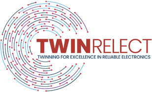

# UPSET

<p align="center">
  
</p>


## Table of Contents
- [What is UPSET?](#what-is-upset)
- [How to Start](#how-to-start)
- [DEMO](#demo)
- [Related Publications](#related-publications)
- [License](#license)
- [Citation](#citation)

## Acknowledgements

Special thanks to IHP Microelectronics for their financial support during the development of UPSET.

<p align="center">
  
</p>


UPSET developement as well as its integration with other circuit reliability tools will be continued during the next years as part of the [TWINRELECT](https://twin-relect.uth.gr/) Europen project.

<p align="center">
  
</p>

## What is UPSET?

UPSET is a Single Event Transient (SET) Analysis tool supporting both SET Generation and Propagation for whole circuits, based on Static Timing Analysis (STA). STA emulated signal propagation, from all timing path start points, through combinational logic to circuit endpoints, by propagating both rise/fall delays and slews and supports both the standard NLDM (Non-Linear Delay Model), as well as the more advanced CCS (Composite Current Source) timing model. By utilising CASlab's STA engine for SET generation and propagation, UPSET is able to model transient faults, originated by particles strikes, (i) with _acceptable loss of accuracy over SPICE_, and (ii) using static analysis over simulation, resulting in _many orders of magnitude speedup_.

## How to Start
All the necessary files are packaged in the UPSET tarball listed in the [releases](https://github.com/Circuits-and-Systems-Lab-CASlab/UPSET/releases) section. The user only needs to download and extract its contents to a preferred location, then run the setup script. For more information regarding the use of UPSET, please refer to the [documentation](https://circuits-and-systems-lab-caslab.github.io/UPSET/).

> [!WARNING]
> Version 1.0.0 of UPSET was built for CentOS 7. All versions of UPSET after that are built for Ubuntu 20.04 and are compatible with the docker setup.
> Moreover, UPSET executable and the docker setup are compatible ONLY with x86_64 architectures. If you are using a different architecture, please contact us at [our mail](mailto:uth.eda.lab@gmail.com) for further assistance.

## Running UPSET with Docker

In order to run UPSET with docker, the user needs to download the UPSET tarball listed in the [releases](https://github.com/Circuits-and-Systems-Lab-CASlab/UPSET/releases) section and save it in the `data` folder of the `Docker_files` folder and then build the docker and run it. Thiis can be done by following these steps:

```bash
cd Docker_files
mkdir data
cp -r <INSTALL folder> data
cd create_docker
make build-docker
cd ../use_docker
make run

/* In Docker Environment */
cd /home/UPSET
./UPSET

/* Save/Load Docker Image */
cd create_docker
make save
cd use_docker
make load
```

## DEMO
Below there is a demo video of perfoming an exhaustive SET analysis in UPSET.

<video src="https://github.com/user-attachments/assets/3d5a8ced-c762-4319-b15e-38494c769b65
" controls="controls" width="100%"></video>

A higher definition of the demo can be found in [Youtube](https://youtu.be/6DBn7oiXmvQ)

## Related Publications
Below you can find a list of the publications that are related to UPSET engine.

- [Towards a Comprehensive SET Analysis Flow for VLSI Circuits using Static Timing Analysis](https://ieeexplore.ieee.org/document/10090747)
   - **Authors**: Christos Georgakidis, Dimitris Valiantzas, Stavros Simoglou, Iordanis Lilitsis, Nikolaos Chatzivangelis, Ilias Golfos, Marko Andjelkovic, Christos Sotiriou, Milos Krstic
   - **Conference**: 2023 IEEE International Symposium on Defect and Fault Tolerance in VLSI and Nanotechnology Systems (DFT)


## Citation
If you use UPSET in your research, please cite the following paper:

```
@inproceedings{georgakidis2023towards,
  title={Towards a Comprehensive SET Analysis Flow for VLSI Circuits using Static Timing Analysis},
  author={Georgakidis, Christos and Valiantzas, Dimitris and Simoglou, Stavros and Lilitsis, Iordanis and Chatzivangelis, Nikolaos and Golfos, Ilias and Andjelkovic, Marko and Sotiriou, Christos and Krstic, Milos},
  booktitle={2023 IEEE International Symposium on Defect and Fault Tolerance in VLSI and Nanotechnology Systems (DFT)},
  pages={1--6},
  year={2023},
  organization={IEEE}
}
```
