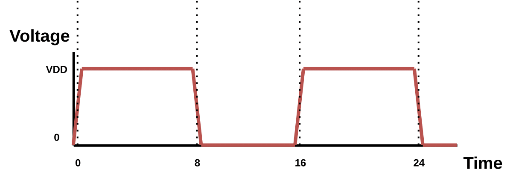

# Commands Reference Manual

## load_lef

Import LEF library files. Technology LEF, i.e. the LEF containing the routing layer info, must be the first in the line.

**Syntax:**

```tcl
%> load_lef {<filenames>}
```

**Arguments:**

- `<filenames>` is the list of the LEF files to be loaded

## load_lib

Import LIB library files. Each LIB file is read as a corner. Error reporting is enabled using the `-errors` flag.

**Syntax:**

```tcl
%> load_lib {<filenames>} ?-errors?
```

**Arguments:**

- `<filenames>` is the list of the LIB files to be loaded
- `-errors` is an optional flag that enables error reporting

## load_verilog

Import design. Supported format is gate-level Verilog netlist.

**Syntax:**

```tcl
%> load_verilog {<filenames>}
```

## load_spef

Import design parasitics. Supported format is SPEF. Different parasitics may be used for worst case and best case analysis Arguments `-longest` and `-shortest` are used to associate parasitics with analysis type. Error report is enabled using the `-errors` flag.

**Syntax:**

```tcl
%> load_spef (-longest | -shortest) ?-errors? {filenames}
```

**Arguments:**

- `-longest`is for the worst case analysis
- `-shortest` is for the best case analysis
- `-errors` is an optional flag that enables error reporting

## read/load_saif

Import SAIF file. A SAIF file is used to annotate the circuit of each gatepin switching activity and logic state duration during simulation.

**Syntax:**

```tcl
%> read_saif <saif_file_>
# or alternatively
%> load_saif <saif_file_>
```

## list_saif_info

List all SAIF information stored in memory.

**Syntax:**

```tcl
%> list_saif_info
```

## set_timing_model

Define the timing model used in the current session.

**Syntax:**

```tcl
%> set_timing_model <nldm | ccs>
```

## set_timing_RC_mode

Define the interconnect timing model used in the current session.

**Syntax:**

```tcl
%> set_timing_RC_mode <lumpedRC | pimodelRC | detailedRC>
```

## set_SET_analysis_mode

Set the SET analysis mode. Two modes are available, Vector-based and Probabilistic. Each mode is described at Section [SET Propagation STA-modes](set_analysis_flow.md#set-propagation-sta-modes). The default analysis mode is Vector-based.

**Syntax:**

```tcl
%> set_SET_analysis_mode <0: Vector-based | 1: Probabilistic>
```

!!! example

    ```tcl
    %> set_SET_analysis_mode 0
    ```

## create_clock



Create a clock in the current design and define its waveform. The `-waveform` argument is optional and can be used to create a pulse whose edges are explicitly defined with the given timestamps.

**Syntax:**

```tcl
%> create_clock <source_gatepin> -period <period_value> ?-name <clock_name>? ?-waveform {edge_list}?
```

**Arguments:**

- `-period` is the period of the clock
- `-name` is the name of the clock
- `-waveform` is the waveform rise and fall edge pairs

!!! example

    ```tcl
    %> create_clock clk -name clk -period 10 -waveform {0 8}
    ```

## set_input_delay

Set delay from environment launching elements to design Top-Level inputs and constrain them. Specified delay may be used for worst case or best case analysis. Also, specified delay direction can be either rise or fall. Input delay must be specified with reference to a clock. Argument `-clock` is used to specify the reference clock.

**Syntax:**

```tcl
%> set_input_delay <delay_value> ?-clock <clock_name>? ?-rise|-fall? ?-max|-min? ?-add_delay? {port_pin_list}
```

**Arguments:**

- `-clock` is the name of the reference clock
- `-rise` is for rise delay specification
- `-fall` is for fall delay specification
- `-max` is for worst case analysis
- `-min` is for best case analysis
- `-add_delay` is used to add the specified delay to the already stored delay

## set_output_delay

Set delay from design Top-Level outputs to environment capturing elements and constrain them. The specified delay must be used either for worst-case or best-case analysis. Also, the specified delay direction can be either rise or fall. Output delay must be specified with reference to a capturing clock. Argument `-clock` is used to specify the reference clock.

**Syntax:**

```tcl
%> set_output_delay <delay_value> ?-clock <clock_name>? ?-rise|-fall? ?-max|-min? ?-add_delay? {port_pin_list}
```

**Arguments:**

- `-clock` is the name of the reference clock
- `-rise` is for rise delay specification
- `-fall` is for fall delay specification
- `-max` is for worst case analysis
- `-min` is for best case analysis
- `-add_delay` is used to add the specified delay to the already stored delay

## report_timing

Perform STA using the specified library corner. Both worst case and best case analysis are supported. Also, for performance reasons, slack is calculated by default only on timing path endpoints. Argument `-backannotate` is used to calculate global slack.

**Syntax:**

```tcl
%> report_timing ?-longest|-shortest -corner <corner_index>? ?-backannotate?
```

**Arguments:**

- `-longest` is for the worst case analysis
- `-shortest` is for the best case analysis
- `-corner` is used to select the library corner to be used for the STA timing analysis
- `-backannotate` is used to calculate global slack

## create_particle_profile

Create a particle profile from the parameters of Double Exponential (DEXP) current source (tdelay, tau1, tau2, q).

**Syntax:**

```tcl
%> create_particle_profile -name <name> -tdelay <double exponential delay> -tau1 <double exponential tau1> -tau2 <double exponential tau2> -q <double exponential q>
```

**Arguments:**

- `-name` is the name of the particle profile
- `-tdelay` is the delay till the start of the current pulse waveform
- `-tau1` is the rise time of the pulse waveform
- `-tau2` is the fall time of the pulse waveform
- `-q` is the collected charge which is relevant to the peak current of the pulse waveform

!!! example

    ```tcl
    create_particle_profile -name p1 -tdelay 0.1ns -tau1 0.1 -tau2 0.1 -q 400
    ```

## delete_particle_profile

Delete a particle profile from memory.

**Syntax:**

```tcl
%> delete_particle_profile <profile_name>
```

## clear_particle_profiles_info

Clear all the particle profiles stored in memory.

**Syntax:**

```tcl
%> clear_particle_profiles_info
```

## list_particle_profiles

List all the particle profiles stored in memory.

**Syntax:**

```tcl
%> list_particle_profiles
```

## create_SET_scenario

Create a single SET scenario in memory. The create SET scenario will be considered when generating SET pulses. User can either define a particle profile with `-profile` parameter or by specify right away the parameters of the DEXP current source.

**Syntax:**

```tcl
%> create_SET_scenario <driver_gatepin> ?<endpoint>? (-profile <particle_profile_name> | <tdelay>n <tau1>p <tau2>p <q>)
```

**Arguments:**

- `<driver_gatepin>` is the name of the driver gate pin
- `<endpoint>` is the name of the endpoint gate pin (for which information is stored)
- `<particle_profile_name>` is the name of the particle profile
- `<tdelay>` is the delay till the start of the current pulse waveform
- `<tau1>` is the rise time of the pulse waveform
- `<tau2>` is the fall time of the pulse waveform
- `<q>` is the collected charge which is relevant to the peak current of the pulse waveform

!!! example

    **Example 1:**

    ```tcl
    create_SET_scenario SET_testcase/U25/Q 0.1n 47p 347p 700f
    ```

    **Example 2:**
    
    ```tcl
    create_SET_scenario SET_testcase/U25/Q -profile p1
    ```

## load_SET_scenarios

A scenario file consists of scenarios specifying a driver pin, an endpoint and the parameters of the Double Exponential (DEXP) current source (`tdelay`, `tau1`, `tau2`, `q`).

!!! example

    Scenario file example:

    ```text
    module1/reg1/Q module1/reg2/D 0.5n 54p 391p 342f
    module2/reg1/Q module2/reg2/D 0.5n 56p 377p 367f
    ```

The command is used to load a scenario file in memory, which will be used to generate SET pulses in future releases.

**Syntax:**

```tcl
%> load_SET_scenarios <filename>
```

**Arguments:**

- `<filename>` is the name of the scenario file

## list_SET_scenario

List information for a specific SET scenario based on the specified scenario index.

**Syntax:**

```tcl
%> list_SET_scenario <scenario_index>
```

## list_SET_scenarios

List information for all the SET scenarios stored in memory.

**Syntax:**

```tcl
%> list_SET_scenarios
```

## clear_SET_scenarios

Clear all the SET scenarios stored in memory.

**Syntax:**

```tcl
%> clear_SET_scenarios
```

## create_SET_scenario_case_analysis

Create SET case analysis for specified scenario (`-scenario`). SET case analysis consists of a scenario index, which represents the affected scenario, a boolean constant value which is applied to specified gatepins and a list of gatepins which will be set to previously defined constant value.

**Syntax:**

```tcl
%> create_SET_scenario_case_analysis -scenario <scenario index> <boolean constant value> {<gatepin>}
```

!!! example

    ```tcl
    %> create_SET_scenario_case_analysis -scenario 0 0 buffer_tree/AND1/B
    ```

## list_SET_scenario_case_analysis

List specified SET scenario case analysis info. Use `-all` argument to list all SET scenarios’ case analysis info.

**Syntax:**

```tcl
%> list_SET_scenario_case_analysis -scenario <scenario index> | -all
```

## clear_SET_scenario_case_analysis

Clear specified SET scenario case analysis info. Use `-all` argument to clear all SET scenarios case analysis info.

**Syntax:**

```tcl
%> clear_SET_scenario_case_analysis -scenario <scenario index> | -all
```

## set_static_probability

Set the logic-1 static probability value to the specified gatepin. Use -value argument to define the probability value. Note that the logic-1 and logic-0 probabilities are complementary, so only one of the two must be defined. Use -gatepin argument to define the gatepin for which the probability is set. Use -all argument to set the probability for all gatepins. Use `-startpoints` argument to set the probability for startpoint gatepins.

**Syntax:**

```tcl
%> set_static_probability -value <probability_value> (-gatepin <gatepin_name> | -all | -startpoints)
```

**Arguments:**

- `-value` is the static probability logic-1 value
- `-gatepin <gatepin_name>` is the name of the gatepin for which the probability is to be set
- `-all` is used to set the probability for all gatepins
- `-startpoints` is used to set the probability for startpoint gatepins

## list_cubes_propagating_input_SETs_to_output

Generate a list of Boolean cubes containing the side-input values that enable the propagation of SETs from the inputs of the gate to the specified output gatepin.

**Syntax:**

```tcl
%> list_cubes_propagating_input_SETs_to_output <gatepin_name> -inputSET [<0 (logic-0) | 1 (logic-1) | 0e (negative SET) | 1e (positive SET) | dc (don't care)> ...]
```

**Arguments:**

- `inputSET` is the list of input SETs. Available options are **0** (logic-0), **1** (logic-1), **0e** (negative SET), **1e** (positive SET), **dc** (don't care)

<!-- TODO: add example -->

## list_static_probabilities

Propagate and list all static probabilities stored in memory per gatepin in a column format report. Use `-significant_digits` argument to set the floating point precision in the report.

**Syntax:**

```tcl
%> list_static_probabilities -significant_digits <significant_digits>
```

**Arguments:**

- `-significant_digits` is the floating point precision in the report

## reset_static_probabilities

Reset static probabilities annotated by SAIF file or set by [set_static_probability](#set_static_probability)

**Syntax:**

```tcl
%> reset_static_probabilities
```

## set_SET_generation_parameters

Set the SET generation model and each model’s parameters. Two models can be specified, Double Exponential (**DEXP**) or Bias Dependent (BIAS). Bias Dependent model parameters consist of the auxiliary Capacitance (`-biascapacitance`), Recombination Currents (`-recomb`) and Fermi (`-fermi`) constants. SET generation model and its parameters apply to all loaded scenarios when generate_SET_glitch or generate_SET_scenario_glitch are used to generate the SET glitch.

**Syntax:**

```tcl
%> set_SET_generation_parameters -model <DEXP | BIAS> -biascapacitance <BIAS capacitance> -recomb <recombination currents constant> -fermi <fermi constant>
```

**Arguments:**

- `-model` is the SET generation model (Double Exponential or Bias Dependent)
- `-biascapacitance` is Bias Dependent model auxilary capacitance to enure charge conservation
- `-recomb` is the Bias Dependent model Recombination Currents constant
- `-fermi` is the Bias Dependent model Fermi constant

!!! example

    ```tcl
    %> set_SET_generation_parameters -model BIAS -biascapacitance 1p -recomb 1e11 -fermi 0.01
    ```

## generate_SET_scenario_glitch

Generate an SET glitch from a single scenario (`-scenario`) load in memory or from all scenarios (`-all`) loaded and store the rise and fall arrival times and slews at the receiver gatepins of the driver gatepin net.

**Syntax:**

```tcl
%> generate_SET_scenario_glitch -scenario <scenario_index> | -all ?-corner <corner_index>?
```

**Arguments:**

- `-scenario` is the scenario index to be used for the SET glitch generation
- `-all` is used to generate the SET glitch for all the defined SET scenarios
- `-corner` is the index of the library corner to be used for the SET glitch generation

!!! example

    ```tcl
    %> generate_SET_scenario_glitch -scenario 1 -corner 0
    %> generate_SET_scenario_glitch -all -corner 0
    ```

## generate_SET_scenario_custom_glitch

Generate a SET glitch as a PWL (Piece Wise Linear) voltage waveform to a receiver gatepin and store it as a new scenario. Afterwards, the specified glitch can be propagated through propagate_SET_scenario_glitch.

**Syntax:**

```tcl
%> generate_SET_scenario_custom_glitch -scenario <receivergatepin> {t0 v0 t1 v1 ... tn vn} -corner <corner_index>
```

**Arguments:**

- `-scenario` is the SET generation scenario, PWL Voltage Waveform at a receiver gatepin
- `-corner` is the index of the library corner to be used for the SET glitch generation

!!! example

    ```tcl
    %> generate_SET_scenario_custom_glitch -scenario buffer_tree/U2/A {0n 0 1n 0 1.005n 0.20 1.015n 0.90 1.02n 1.08 1.09n 1.08 1.2n 0.9 1.6n 0.1 1.8n 0 3n 0} -corner 0
    ```

## propagate_SET_scenario_glitch

Propagate a SET glitch from a single scenario loaded in memory (`-scenario`) or from all scenarios loaded (`-all`). Before running this command, the SET pulse must be generated, using the command [generate_SET_scenario_glitch](#generate_set_scenario_glitch).

**Syntax:**

```tcl
%> propagate_SET_scenario_glitch -scenario <scenario_index> | -all ?-corner <corner_index>?
```

**Arguments:**

- `-scenario` is the scenario index to be used for the SET glitch propagation
- `-all` is used to propagate the SET glitch for all the defined SET scenarios
- `-corner` is the index of the library corner to be used for the SET glitch propagation

!!! example

    ```tcl
    %> propagate_SET_scenario_glitch -scenario 1 -corner 0
    %> propagate_SET_scenario_glitch -all -corner 0
    ```

## set_SET_glitch_propagation_mode

Set the SET glitch propagation STA-mode. Three modes are available, **"Vanilla"**, **Detailed Timestamp-based** and **Bounded Timestamp-based**. Each mode is described in section [SET Propagation STA-modes](set_analysis_flow.md#set-propagation-sta-modes). The default mode is **"Vanilla"**.

**Syntax:**

```tcl
%> set_SET_glitch_propagation_mode <0: "Vanilla" STA-mode | 1: Detailed TimeStamp-based STA-mode | 2: Bounded TimeStamp-based STA-mode>
```

## generate_SET_glitch

Generate an SET glitch. The command requires specifying the SET generation scenario. The SET generation scenario consists of a specified driver pin, which represents the affected net, the endpoint where measurements are taken, and the Double Exponential Current Source (**DEXP**) parameters. The command created SPICE probes internally at all affected nets receivers, in order to take rise and fall arrival times and slew measurements. These probes are cleared after the glitch generation is completed. Upon completion, the command prints the calculated rise and fall arrival times and slews.

**Syntax:**

```tcl
%> generate_SET_glitch -scenario <drivergatepin> <endpoint> <tdelay> <tau1> <tau2> <q> -corner <corner_index>
```

**Arguments:**

- `-scenario` is the SET generation scenario, consisting of the driver gatepin, the endpoint, and the DEXP parameters
- `-corner` is the index of the library corner to be used for the SET glitch generation

!!! example

    ```tcl
    %> generate_SET_glitch -scenario ASU_2bufs/U1/Y ASU_2bufs/U2/A 0.1n 47p 347p 700f -corner 0
    ```

## propagate_SET_glitch

Propagate the rise (`-rise`) and fall (`-fall`) arrival times and slews from the input gatepin given as argument (`-gatepin`) to the forward logic cone.

**Syntax:**

```tcl
%> propagate_SET_glitch -gatepin <receivergatepinname> -rise {risearrival_1 riseslew_1 ... risearrival_N riseslew_N} -fall {fallarrival_1 fallslew_1 ... fallarrival_N fallslew_N} ?-corner <corner_index>?
```

**Arguments:**

- `-gatepin` is the name of the input gatepin from where the SET propagation starts
- `-rise` is the list of rise arrival times and slews
- `-fall` is the list of fall arrival times and slews
- `-corner` is the index of the library corner to be used for the SET glitch propagation

!!! example

    ```tcl
    %> propagate_SET_glitch -gatepin buffer_tree/U2/A -rise {0.123118 0.052256} -fall {0.500256 0.693101}
    ```

## set_net_supply

Set the voltage/current source supply for the specified net and define the transient specification of the supply. Supported transient specifications: Piece-Wise Linear (**PWL**), Double Exponential (**DEXP**).

**Syntax:**

```tcl
%> set_net_supply <supplyname> <drivergatepin> <groundname> <transientspec> {<transientspec args>}
```

!!! example

    ```tcl
    %> set_net_supply ISET ASU_2bufs/U1/Y 0 DEXP {{0.5n 47p 647p 282f}}
    ```

## simulate_net

Perform SPICE simulation for the specified gatepin net.

**Syntax:**

```tcl
%> simulate_net <driver_gatepin>
```

## set_spice_simulation_parameters

Specify SPICE simulation time step and total duration.

**Syntax:**

```tcl
%> set_spice_simulation_parameters -timestep <timestepvalue> -totalduration <totaldurationvalue>
```

**Arguments:**

- `-timestep` is the transient analysis time step value
- `-totalduration` is the total duration value

## create_net_spice_probe

Create a probe for storing SPICE simulation data. Voltage probes are specified at a single node with reference to GND, while current probes are specified at net supplies.

**Syntax:**

```tcl
%> create_net_spice_probe <drivergatepin> (-node <spefnodename> | -vnode <voltagesourcename> | -all) ?-longest | -shortest?
```

**Arguments:**

- `-node` is the SPEF net node
- `-vnode` is the voltage source name
- `-all` is used to create probes at all nodes
- `-longest` is used for worst case analysis
- `-shortest` is used for best case analysis

!!! example

    ```tcl
    5> create_net_spice_probe ASU_2bufs/U1/Y -node 3:1 -longest
    ```

## plot_spice_probe

Plot specified probe data. The desired probes are specified by their list index. Use the command [list_spice_probes](#list_spice_probes) to print all spice probes and their index.

**Syntax:**

```tcl
%> plot_spice_probe {probelist}
```

## list_spice_probes

List all the SPICE probes stored in memory.

**Syntax:**

```tcl
%> list_spice_probes
```

## perform_exhaustive_SET_analysis

Performs exhaustive SET analysis. For each defined particle profile, iterates through all output gatepins and creates an SET scenario for each one. Then, after all scenarios have been created, generation followed by propagation of the SET glitch is performed for each SET scenario.

**Syntax:**

```tcl
%> perform_exhaustive_SET_analysis
```

## perform_SET_analysis

Heuristic SET analysis flow. Run the SET analysis for a set of particle profiles and a set of output gatepins. For each given output gatepin a SET scenario will be created for each given particle to perform the SET analysis flow (generation & propagation). This command is an alternative to [perform_exhaustive_SET_analysis](#perform_exhaustive_set_analysis) in case the user wants to run the analysis for specific portions of the circuit and particle profiles.

**Syntax:**

```tcl
%> perform_SET_analysis -profiles {<profile1> <profile2> ...} -gatepins {<gatepin1> <gatepin2> ...}
```

**Arguments:**

- `-profiles` is the list of particle profiles to be used for the SET analysis
- `-gatepins` is the list of output gatepins to be used for the SET analysis

!!! example

    ```tcl
    %> perform_SET_analysis -profiles {p1 p2 p3} -gatepins {SET_testcase/U1/Q SET_testcase/U2/Q SET_testcase/U3/Q SET_testcase/U4/Q}
    ```

## list_gatepins_set_analysis_info

List SET analysis information for a specific gatepin.

**Syntax:**

```tcl
%> list_gatepins_set_analysis_info <gatepin_name>
```

## list_all_gatepin_set_analysis_info

List SET analysis information for all gatepins.

**Syntax:**

```tcl
%> list_all_gatepin_set_analysis_info
```

## report_SET_scenario_timingpoints

Lists for a specific scenario the timingpoints, i.e., the forward logic cone gatepins that
have been traversed by the glitch.

**Syntax:**

```tcl
%> report_SET_scenario_timingpoints <scenario_index>
```

## report_SET_generation_probabilities

Report positive and negative SET generations probabilities for all gatepins.

**Syntax:**

```tcl
%> report_SET_generation_probabilities
```

## eco_swap_component_pins

Rewire two input pins of a component.

**Syntax:**

```tcl
%> eco_swap_component_pins <component_name> <pin_name_1> <pin_name_2>
```

**Arguments:**

- `<component_name>` is the name of the target component to perform rewiring
- `<pin_name_1>` is the name of the first pin to be rewired
- `<pin_name_2>` is the name of the second pin to be rewired

## eco_upsize_component

Upsize a component to the immediate larger component.

**Syntax:**

```tcl
%> eco_upsize_component <component_name> ?-overlapsmethod <1 | 2 | 3>?
```

**Arguments:**

- `<component_name>` is the name of the target component to upsize
- `-overlapsmethod` is the overlap handling method (optional)
    - `1`: remove from rows and mark as illegal only the overlapping components (default)
    - `2`: remove from rows and mark as illegal both the resized and the overlapping components
    - `3`: remove from rows and mark as illegal only the resized component

## eco_downsize_component

Downsize a component to the immediate smaller component.

**Syntax:**

```tcl
%> eco_downsize_component <component_name> ?-overlapsmethod <1 | 2 | 3>?
```

**Arguments:**

- `<component_name>` is the name of the target component to downsize
- `-overlapsmethod` is the overlap handling method (optional)
    - `1`: remove from rows and mark as illegal only the overlapping components (default)
    - `2`: remove from rows and mark as illegal both the resized and the overlapping components
    - `3`: remove from rows and mark as illegal only the resized component

## eco_charge_sharing

Insert charge-sharing logic to a target gatepin.

**Syntax:**

```tcl
%> eco_charge_sharing <target_gatepin> -cell <delay_cell> -num <number_of_delay_cells> ?-placementmethod <0 (Default Placement) | 1 (Place in the centre-of-mass) | 2 (Place in the centre-of-mass and remove overlapping components)>?
```

**Arguments:**

- `<target_gatepin>` is the name of the target gatepin to insert charge-sharing logic
- `-cell` is the name of the delay cell to be used for the charge-sharing logic
- `-num` is the number of delay cells to be used for the charge-sharing logic
- `-placementmethod` is the placement method (optional)
    - `0`: place the new components at (0, 0) (default)
    - `1`: place the new components at the centre of mass
    - `2`: place the new components at the centre of mass and remove overlapping components

## eco_fanout_decomposition

Perform fan-out decomposition in a target component by performing gate cloning on the target component and splitting the fan-out of the target gatepin.

**Syntax:**

```tcl
%> eco_fanout_decomposition <target_component> ?-placementmethod <0 (Default Placement) | 1 (Place in the centre-of-mass) | 2 (Place in the centre-of-mass and remove overlapping components)>?
```

**Arguments:**

- `<target_component>` is the name of the target component to perform fan-out decomposition
- `-placementmethod` is the placement method (optional)
    - `0`: place the new components at (0, 0) (default)
    - `1`: place the new components at the centre of mass
    - `2`: place the new components at the centre of mass and remove overlapping components

## eco_tmr_component

Apply Triple Modular Redundancy (TMR) to a target component. The target component is triplicated with the input of each replica being tied together and their outputs connected to a majority voter. As for the majority voter, UPSET uses the NAND based majority voter, which is shown in the [figure](set_optimisation_techniques.md#fig:majority_voter).

**Syntax:**

```tcl
%> eco_tmr_component <component_name> ?-placementmethod <0 (Default Placement) | 1 (Place in the centre-of-mass) | 2 (Place in the centre-of-mass and remove overlapping components)>?
```

**Arguments:**

- `<component_name>` is the name of the target component to apply TMR
- `-placementmethod` is the placement method (optional)
    - `0`: place the new components at (0, 0) (default)
    - `1`: place the new components at the centre of mass
    - `2`: place the new components at the centre of mass and remove overlapping components

## eco_insert_filter

Insert a SET filter to a target gatepin. The SET filter is composed by a guard gate and a delay line.

!!! bug
    The current version of SET filter insertion is supporting the insertion of an AND gate for the voting, instead of a guard gate. However, this is not correct, since the AND gate will result in broadening negative (1->0->1) SET pulses instead of attenuating them. Thus, the SET filter insertion should be updated to support the insertion of a guard gate in the next release.

**Syntax:**

```tcl
%> eco_insert_filter <target_gatepin> -cell <delay_cell> -num <number_of_delay_cells> -AND <AND_cell> ?-placementmethod <0 (Default Placement) | 1 (Place in the centre-of-mass) | 2 (Place in the centre-of-mass and remove overlapping components)>?
```

**Arguments:**

- `<target_gatepin>` is the name of the target gatepin to insert a SET filter
- `-cell` is the name of the delay cell to be used for the SET filter
- `-num` is the number of delay cells to be used for the SET filter
- `-AND` is the name of the AND cell to be used for the SET filter
- `-placementmethod` is the placement method (optional)
    - `0`: place the new components at (0, 0) (default)
    - `1`: place the new components at the centre of mass
    - `2`: place the new components at the centre of mass and remove overlapping components

## eco_insert_cascaded_inverter

Insert a pair of cascaded inverters to a target gatepin.

**Syntax:**

```tcl
%> eco_insert_cascaded_inverter <target_gatepin> -cells <cell 1> <cell 2> ?-placementmethod <0 (Default Placement) | 1 (Place in the centre-of-mass) | 2 (Place in the centre-of-mass and remove overlapping components)>?
```

**Arguments:**

- `<target_gatepin>` is the name of the target gatepin to insert a cascaded inverter
- `-cells` is the name of the INV cells to be used for the cascaded inverters
- `-placementmethod` is the placement method (optional)
    - `0`: place the new components at (0, 0) (default)
    - `1`: place the new components at the centre of mass
    - `2`: place the new components at the centre of mass and remove overlapping components


## legalise_components

Perform legalisation of the circuit components.

**Syntax:**

```tcl
%> legalise_components -order <0 (all) | 1 (increasing) | 2 (decreasing) | 3 (centre-outwards)> -blockagesmethod <0 (Subrow Assignment - SRA) | 1 (Subrow Reassignment - SRR)> ?-timingdriven <longest | shortest>? ?-htmlreport <filename>?
```

**Arguments:**

- `-order` is the order of the legalisation
    - `0`: all of the 3 supported orders and choose the best one
    - `1`: increasing order of components x-coordinates
    - `2`: decreasing order of components x-coordinates
    - `3`: centre-outwards order of components x-coordinates
- `-blockagemethod` is the blockage method
    - `0`: Subrow Assignment - SRA
    - `1`: Subrow Reassignment - SRR
- `-timingdriven` is the timing driven analysis (optional)
- `-htmlreport` is the name of the HTML report file to be generated (optional)