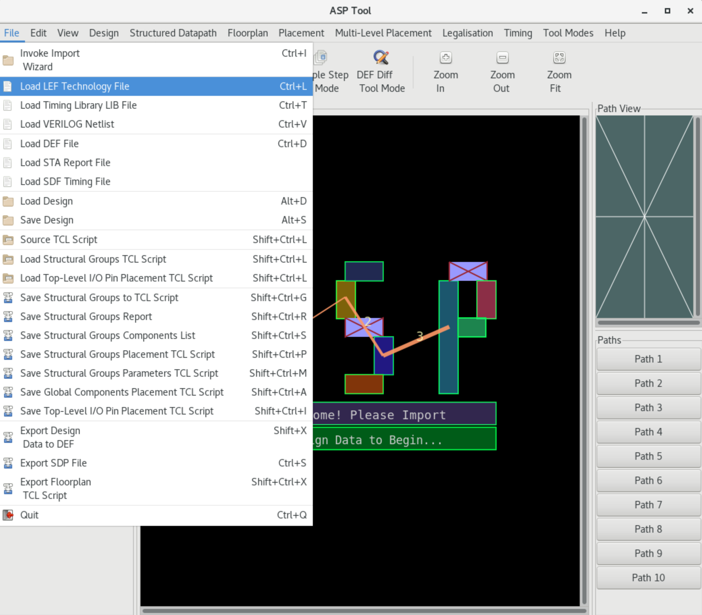
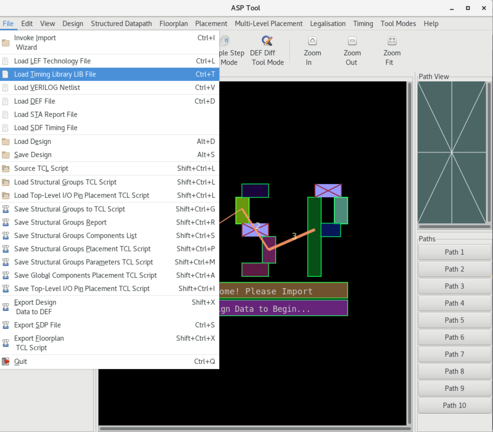
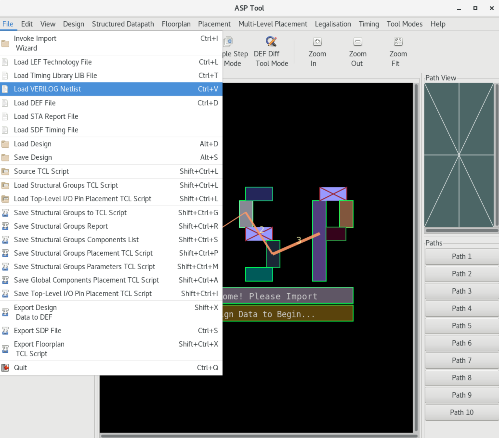
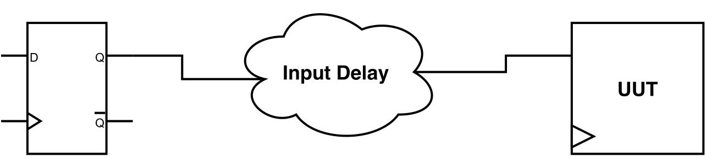
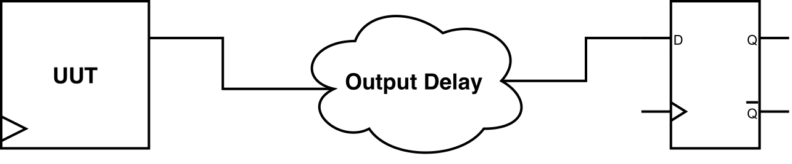
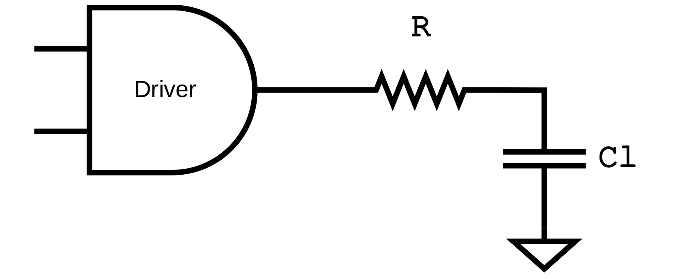
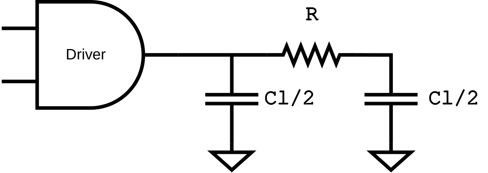
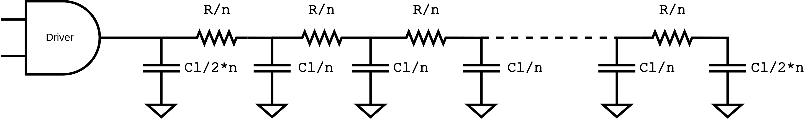

# Pre-SET Analysis Design Configuration

## Step 1: Import Design

### Import LEF

The LEF file should include all the technology library cells present in the Verilog netlist, as LEF Macros which describe the physical dimensions for the library components. The LEF file should also include SITE declarations, i.e. placement sites which will subsequently be used to create the standard-cell rows for the placement. Also, multiple LEF files are supported. LEF file is necessary for the SET Analysis flow.

The LEF file can be loaded either by the TCL command:

```tcl
%> load_lef {<lef_file_>}
```

or using the keystroke `Ctrl+L"` or using the GUI menu `File -> Load LEF Technology File`.



### Import LIB

Liberty (LIB) library file specifies the cells that exist in the library and for each one of them, it defines attributes such as pin names, area, functionality, timing, power, etc. Multiple LIB files can be loaded, one for each operation corner. LIB file is necessary for the SET Analysis flow.

The LIB file can be loaded either by the TCL command:

```tcl
%> load_lib {<lib_file_>} ?-errors?
```

or using the keystroke `Ctrl+T"` or using the GUI menu `File -> Load Timing Library LIB File`.



### Import Verilog

The Verilog gate-level netlist file describes the circuit connectivity, as well as the module hierarchy. The netlist should be uniquified so that each module instantiation corresponds directly and is 1-1 to a corresponding module declaration. Loading Verilog file is necessary for the SET Analysis flow.

The Verilog netlist can be loaded either by the TCL command:

```tcl
%> load_verilog {<verilog_file_>}
```

or using the keystroke `Ctrl+V"` or using the GUI menu `File -> Load VERILOG Netlist`.



### Import SPEF

Standard Parasitic Exchange Format (SPEF) is an IEEE standard for representing the parasitic data of the circuit wires, and it used for delay calculation. Non-ideal wires have parasitic resistance and capacitance, while are specified inside the SPEF file. SPEF file is optional for the SET Analysis flow, but it increases its accuracy.

The SPEF file can be loaded for each analysis mode using TCL command:

```tcl
%> load_spef (-longest | -shortest) ?-errors? {<spef_file_>}
```

, where the flags `-longest` and `-shortest` determine that the SPEF file contains the parasitics extracted for the worst or best case analysis, respectively.

### Import SAIF

Switching Activity Interchange Format (SAIF) is an IEEE standard developed by Synopsys &copy; for capturing the toggle rate of the signals in the design and analysing its power consumption. The SAIF file is based on static probability and toggle rate:

- Static Probability: Probability that a signal is at a specific logic state. `P1` is the probability of the signal being at logic-1 and `P0` is the probability of the signal being at logic-0.
- Toggle Rate: The number of transitions of logic-0 to logic-1 and vice versa of each pin per unit of time.

| Terminology | Definition |
| ----------- | ----------- |
| `T0` | Duration of time found in logic-0 state |
| `T1` | Duration of time found in logic-1 state |
| `TX` | During of time found in unknown "X" state |
| `TC` | The sum of 0->1 and 1->0 transitions captured during monitoring |
| `IG` | Number of 0->X->0 and 1->X->1 glitches captured during monitoring |
| `RISE` | Rise transitions in a given state |
| `FALL` | Fall transitions in a given state |

The above table lists some of the basic terms used in the SAIF file. From the above list, for the SET propagation, only the `T0` and `T1` terms are used. SAIF file is optional for the SET Analysis flow, and it increases the accuracy of the probabilistic SET analysis by providing more accurate static probabilities.

The SAIF file can be loaded using the TCL command:

```tcl
%> load_saif <saif_file_>
# or alternatively
%> read_saif <saif_file_>
```
The information for each gatepin is stored in memory by the SAIF annotation can be reported by the TCL command:

```tcl
%> list_saif_info
```
## Step 2: Tool Configuration

### Select Timing Model

UPSET timer supports two industrial models, NLDM and CCS. More details about the supported timing models can be found in section [STA Timing Models](#sta-timing-models). Select the design timing model using the TCL command:

```tcl
%> set_timing_model <nldm | ccs>
```

### Select Interconnect Timing Model

UPSET timer supports also three industrial models  for the modelling of the interconnect effect to the circuit timing:
- Lumped RC,
- Pi-model, and
- Detailed RC.
More details about the supported wire models can be found in section [Wire Models](#wire-models). Select the design interconnect timing model using the TCL command:

```tcl
%> set_timing_RC_mode <lumpedRC | pimodelRC | detailedRC>
```

### Select SET Analysis Mode

UPSET SET Analysis tool supports two modes: (i) Vector-based, (ii) Probabilistic. The SET analysis mode can be set using the TCL command:

```tcl
%> set_SET_analysis_mode <0: Vector-based | 1: Probabilistic>
```

## Step 3: SDC Constraints Specification

### Create Clock

Synchronous designs' frequency is dictated by the use of an external clock. The period, name and waveform of this clock are specified using the SDC command:

```tcl
%> create_clock <source_gatepin> -period <period_value> ?-name <clock_name>? ?-waveform {edge_list}?
```

where:

- `<source_gatepin>` is the name of the source gate pin of the clock
- `<period_value>` is the period of the clock
- `<clock_name>` is the name of the clock
- `<edge_list>` is the waveform rise and fall edge pairs

### Set Input Delay

{ align=right , width=400}

Input delay is the delay between a hypothetical launching sequential element in the design's environment and the design's top-level inputs. Design inputs are constrained using the SDC command:

```tcl
set_input_delay <delay_value> ?-clock <clock_name>? ?-rise | -fall? ?-max | -min? ?-add_delay? {port_pin_list}
```

where:

- `<delay_value>` is the delay value
- `<clock_name>`specifies the hypothetical launching element clock, and therefore the input delay reference
- `-rise`/`-fall` specify the delay direction
- `-max` /`-min` determines the delay analysis type (worst or best case)
- `-add_delay` is used to add the delay in the already stored delay value
- `{port_pin_list}` is the list of input pins to be constrained


### Set Output Delay

{ align=right , width=400}

Output delay is the delay between the specified design's top-level outputs and a hypothetical capturing sequential element in the design's environment. Design outputs are constraints using the SDC command:

```tcl
%> set_output_delay <delay_value> ?-clock <clock_name>? ?-rise | -fall? ?-max | -min? ?-add_delay? {port_pin_list}
```

where:

- `<delay_value>` is the delay value
- `<clock_name>`specifies the hypothetical capturing element clock, and therefore the output required arrival time
- `-rise`/`-fall` specify the delay direction
- `-max` /`-min` determines the delay analysis type (worst or best case)
- `-add_delay` is used to add the delay in the already stored delay value
- `{port_pin_list}` is the list of output pins to be constrained

## Step 4: Static Timing Analysis (STA)

Timing analysis is performed to guarantee worst-case or best-case timing is met, based on the specified SDC constraints. To perform STA, use the TCL command:

```tcl
%> report_timing ?-longest | -shortest -corner <corner_index>? ?-backannotate?
```

where:

- `-longest` and `-shortest` is used to determine the delay analysis type (worst or best case)
- `-corner` is used to select the library corner to be used for the STA timing analysis
- `-backannotate` is used to perform slack annotation for all the circuit gatepins.

!!! info
    For performance reasons, slack is checked only at the timing paths endpoints. Use argument `-backannotate` to calculate global slack.

The default command arguments are:

```tcl
%> report_timing -longest -corner 0
```

### STA Timing Models

Timing models are framework to accurately predict and analyse, under different conditions, how signals are transformed when they are propagated through the transistor inside the physical layout of each logic gate of a technology. More specifically, these models provide an estimation of the delay and slew at the output pin of the gate. Notably, this estimation is directly related with the signal transition at the related input pins and the load the output pin drives.

Various timing models have been proposed in the literature. However, in recent times, the Non-Linear Delay Model (NLDM) and the Composite Current Source (CCS) have emerged as the industry standards.

=== "Non-Linear Delay Model (NLDM)"

    The Non-Linear Delay Model (NLDM) is a widely used timing model in digital circuit design that provides a detailed representation of the delay and transition characteristics of the logic gates.  NLDM relies on 2D lookup tables (LUTs) to store the delay and output transition times for different combinations of input transition times and output load capacitances. These tables are generated through detailed characterisation of each logic gate under various conditions. This methods provides a significant improvement in accuracy over linear models, as it accounts the complex non-linear behavior observed in real circuits.

    !!! example

        Below is an example of NLDM LUTs for an output pin `OUT`. More specifically, it presents the rise delay and rise transition of the timing arc from input pin `INP1` to output pin OUT. The arc is negative unate meaning that for a rise to occur in the output, the signal at input pin INP1 must be falling. The indices from input transition times (`index_1`) and output capacitances (`index_2`) specify the values along the two dimensions of the table: input transitions (0.1, 0.3, 0.7) and output loads (0.16, 0.35, 1.43). The `values` block then provides the corresponding delay times for each combination of these indices in a matrix format. For example, in the `cell_rise` table, the delay for an input transition time of 0.3 and an output capacitance of 0.35 is found by location the second row and second column in the `values` matrix, yielding 0.2327. This method allows for precise interpolation of delay times based on given input and output conditions.
        
        ```text
        pin (OUT) {
            max_transition : 1.0;
            timing() {
                related_pin : "INP1";
                timing_sense : negative_unate;
                cell_rise(delay_template_3x3) {
                    index_1 ("0.1, 0.3, 0.7"); /* Input transition */
                    index_2 ("0.16, 0.35, 1.43"); /* Output capacitance */
                    values ( /* 0.16       0.35        1.43 */
                    /* 0.1 */ "0.0513,    0.1537,    0.5280",
                    /* 0.3 */ "0.1018,    0.2327,    0.6476",
                    /* 0.7 */ "0.1334,    0.2973,    0.7252");
                }
                rise_transition(delay_template_3x3) {
                    index_1 ("0.1, 0.3, 0.7"); /* Input transition */
                    index_2 ("0.16, 0.35, 1.43"); /* Output capacitance */
                    values ( /* 0.16       0.35        1.43 */
                    /* 0.1 */ "0.0417,    0.1337,    0.4680",
                    /* 0.3 */ "0.0718,    0.1827,    0.5676",
                    /* 0.7 */ "0.1034,    0.2173,    0.6452");
                }
            }
        }
        ```
    
    One of the key benefits of using NLDM is its balance between accuracy and computational efficiency. While it offers a detailed representation of the timing behavior, it does so with a manageable amount of data, making it suitable for use in large-scale digital designs. The interpolation approach used by NLDM ensures that the timing analysis remains efficient, which is particularly important in modern design flows.

    However, the accuracy of NLDM is limited by its reliance on pre-characterised data and interpolation. As process technologies advance to smaller nodes, additional factors such as complex waveform shapes and parasitic effects become more significant. Despite these limitations, NLDM remains a fundamental tool in the timing analysis of digital circuits, offering a practical and effective means of ensuring reliable circuit performance.

=== "Composite Current Source (CCS)"

    The Composite Current Source (CCS) model is an advanced timing and noise modeling approach used in digital circuit design to achieve high accuracy in the timing and reliability analysis of logic cells. Unlike traditional models that primarily focus on voltage-based delay and transition times, CCS models the current behavior of a logic cell. By treating the cell as a current source, CCS captures the detailed shape of the current waveforms, which allows for more precise predictions of delays and signal integrity under various conditions. This is especially crucial for advanced process nodes.

    The CCS model is divided into two main components:
    - CCS Timing: Focuses on the accurate prediction of delay and transition times by considering the current profile profiles of the cell. This involves detailed characterisation of the cell's response to different input transitions and  output loading conditions.
    - CCS Noise: Deals with the way noise propagates through the circuit and affects signal integrity. By modeling the noise as a function of current waveforms, the CSS Noise component provides insights into how susceptible a circuit is to various noise sources, which is essential for ensuring robust operation in noisy environments.

    A significant advantage of the CCS model is its ability to provide accurate timing analysis in the presence of complex interconnect effects and noise phenomena. It captures the impact of input slew rates, output loads and power supply variations on the cell's timing behavior by representing the current flow during switching events. The level of detail helps in predicting how the logic cells will interact with each other in a real beneficial for deep sub-micron technologies, where traditional models might fall short in capturing all relevant effects.

    Implementing CCS  in STA tool involves using current waveform tables similar to NLDM using delay tables. These tables provide a rich set of data that allows for interpolation based on actual operation conditions. The current profiles are used to simulate the behavior of the cells more accurately than voltage-based models. While this approach increases the complexity and computational requirements of the analysis, it significantly enhances the accuracy of timing predictions and noise analysis.

    !!! example

        Below is presented an example of CCS lookup table for an output pin OUT. Similarly to NLDM LUTs, CCS LUTs are organised in timing arcs. Here, instead of rise/fall delay and transition tables, the output charging current is provided in the form of a waveform. Attributes `index_1` and `index_2` refer to the input transition and output capacitance, respectively. `reference_time` indicates the time when the input waveform cross the delay threshold voltage. The current waveform is given by `index_3` and `values` attributes, where `index_3` corresponds to the time point of the waveform and `values` to the output current at each tome point. For example, at a time of 5.079e+00 relative to the reference time, the output charging current is -5.784e-02.

        ```text
        pin (OUT) {
            timing () {
                related_pin : "IN"-;
                ...
                output_current_fall () {
                    vector ("LOOKUP_TABLE_1x1x5") {
                        reference_time : 5.06; /* Time of input crossing threshold */
                        index_1("0.040"); /* Input transition */
                        index_2("0.900"); /* Output capacitance */
                        index_3("5.079e+00, 5.093e+00, 5.152e+00,
                                5.170e+00, 5.352e+00"); /* Time values */
                        /* Output charging current: */
                        values("-5.784e-02, -5.980e-02, -5.417e-02,
                                -4.257e-02, -2.184e-03");
                    }
                }
            }
        }
        ```

### Wire Models

In advanced technology nodes, interconnect parasitics play a critical role in determining the performance, power and reliability of the circuits. As device geometries shrink, and operating frequencies increase, the resistance and capacitance of interconnects become more noticeable, affecting the overall signal propagation time. Hence, accurate wire delay estimation is crucial in modern STA engines because it ensures that the timing analysis reflects realistic conditions, allowing designers to identify and mitigate potential timing violations that could lead to functional failures.

Several wire models have been proposed in the literature aiming to estimate wire delay, each varying in complexity and precision. Below are described the wire delay estimation models that are adopted by the UPSET STA engine.

=== "Lumped RC"

    { align=right , width=300}

    The Lumped RC model is the simplest form of wire delay estimation. In this model, the entire resistance (R) and capacitance (C) of an interconnect segment are lumped into a single resistor and capacitor, as shown in the next figure. This model is computationally efficient and provides a quick estimation of delay. However, it is often overly simplistic for complex designs, as it does not account for the distributed nature of resistance and capacitance along the wire. The Lumped RC model is most useful for initial approximations and in scenarios where the interconnect lengths are relatively short, and the distribution effects are minimal.

=== "Pi-Model RC"

    { align=right , width=300}

    The Pi model offers a more refined approach compared to the Lumped RC model by diving the wire's capacitance into two segments, one at each end of the resistor, as shown in the next figure. This division allows for a more accurate representation of the wire's electrical behavior, particulaly for medium-length interconnects. The Pi model captures the effect of the distributed capacitance between than the Lumped RC model, providing a more precise delay estimation while still maintaining relatively low computational efficiency, making it a popular choice in STA tools for intermediate-level analysis.

=== "Detailed RC"

    The Detailed, or distributed RC, model is the most accurate method for wire delay estimation. This model treats the interconnect as a series of small segments, each with its own resistance and capacitance, as shown in the next figure. The delay is calculated by integrating the effects of these small segments along the entire length of the wire. This approach captures the distributed nature of interconnect's electrical properties, providing a highly precise delay estimation. However, it is computationally intensive, requiring sophisticated algorithms and significant processing power. It is typically used in the final design stages or for critical paths where high accuracy is necessary.

    { align=center }


