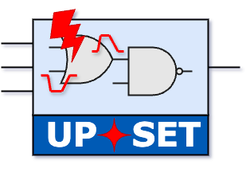

# Introduction to UPSET

<figure markdown="span">
  { width="300" }
</figure>

## Scope of this Document

This document is intended to provide an overview of the UPSET tool usage and flow, detailing some of the tool's technical features and capabilities. It is not intended to be a comprehensive guide to the tool, but rather a starting point for users who are new to the tool and want to understand its basic functionality.

## What is UPSET?

UPSET is a Single Event Transient (SET) Analysis tool, supporting both SET Generation and Propagation for whole circuits, based on Static Timing Analysis (STA). STA emulates signal propagation, from all timing path start points, through combinational logic to circuit endpoints, by propagating both rise/fall delays and slews and supports both the standard NLDM (Non-Linear Delay Model), as well as the more advanced CCS (Composite Current Source) timing model. By utilising CASlab's STA engine for SET generation and propagation, UPSET is able to model transient faults, originated by particle strikes, (i) with *acceptable loss of accuracy over SPICE*, and (ii) using Static analysis over simulation, resulting in *many orders of magnitude of speedup*.

<!-- <a href='mailto:chris.georgakidis@gmail.com'>Christos Georgakidis</a> -->
