# UPSET SET Analysis Flow

The UPSET SET Analysis Flow is shown below.

<figure markdown id="fig:upset_set_analysis_flow">
  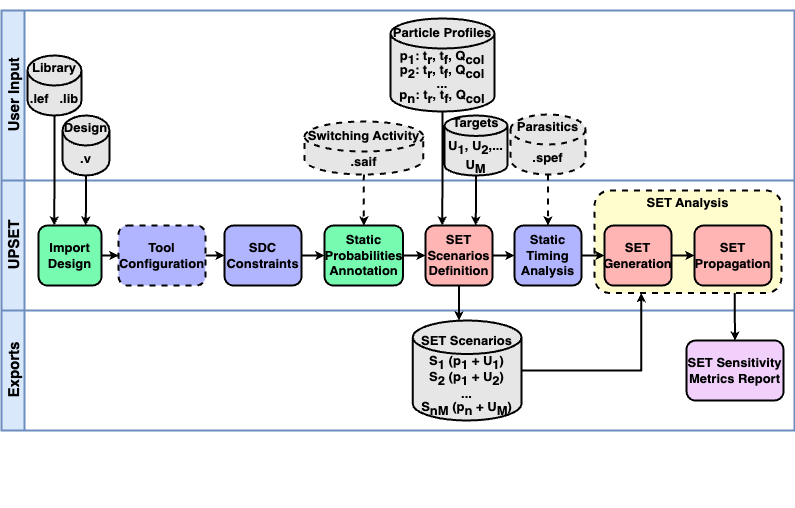
  <figcaption>UPSET SET Analysis Flow</figcaption>
</figure>

## Particle Profile Definition

A particle strike is simulated by default by the Double Exponential (DEXP) current source model which requires the following parameters:

| Parameter | Description |
| --------- | ----------- |
| `tdelay`  | the delay till the start of the current pulse waveform |
| `tau1`    | the rise time of the pulse waveform |
| `tau2`    | the fall time of the pulse waveform |
| `q`       | the collected charge which is relevant to the peak current of the pulse waveform |

The aforementioned parameters describe the characteristics of the particle strike and define a **particle profile**. A particle profile can be defined using the TCL command:

```tcl
%> create_particle_profile -name <profile_name> -tdelay <tdelay_value> -tau1 <tau1_value> -tau2 <tau2_value> -q <q_value>
```

where:

- `<profile_name>` is the name of the particle profile
- `<tdelay_value>` is the delay till the start of the current pulse waveform
- `<tau1_value>` is the rise time of the pulse waveform
- `<tau2_value>` is the fall time of the pulse waveform
- `<q_value>` is the collected charge which is relevant to the peak current of the pulse waveform

The defined particle profiles can be reported using the TCL command:

```tcl
%> list_particle_profiles
```

The specified particle profile(s) can be cleared from the memory using the TCL commands:

```tcl
# Delete a single particle profile
%> delete_particle_profile <profile_name>
# Delete all the defined particle profiles
%> clear_particle_profiles_info
```

!!! danger
    When deleting a particle profile, the associated SET scenarios are also deleted.

## SET Scenarios Definition

The defined particle profiles can be used to define a **SET scenario**. A particle profile combined with a driver pin (and optionally an endpoint) defines a SET scenario. However, instead of a particle profile, the user can specify right away the parameters of the DEXP current source. In that case a new particle profile with these parameters is defined automatically.

!!! note
    In case a particle profile with the same DEXP parameters is already defined, then the existing particle profile is associated with the defined SET scenario.

Defining a scenario in memory can be done using the TCL command:

```tcl
%> create_SET_scenario <driver_pin> ?<endpoint>? -profile (<particle_profile_name> | <tdelay> <tau1> <tau2> <q>)
```

where:

- `<driver_pin>` is the name of the driver pin
- `<endpoint>` is the name of the endpoint pin (for which information is stored)
- `<particle_profile_name>` is the name of the particle profile
- `<tdelay>` is the delay till the start of the current pulse waveform
- `<tau1>` is the rise time of the pulse waveform
- `<tau2>` is the fall time of the pulse waveform
- `<q>` is the collected charge which is relevant to the peak current of the pulse waveform

To load many scenarios at once, a scenario file can be used which contains the designs number of SET scenarios.

!!! example

    Scenario file example:

    ```text
    module1/reg1/Q module1/reg2/D 0.5n 54p 391p 342f
    module2/reg1/Q module2/reg2/D 0.5n 56p 377p 367f
    ```

Loading a scenario file can be done using the TCL command:

```tcl
%> load_SET_scenarios <scenario_file>
```

For a more accurate SET generation the Bias Dependent (BIAS) model can be used. More details about the supported models can be found in section [SET Glitch Generation](#set-glitch-generation).

The information stored for the defined SET scenarios can be reported by the TCL commands:

```tcl
# Report for a Single SET Scenario
%> list_SET_scenario <scenario_index>
# Report for all defined SET Scenarios
%> list_SET_scenarios
```

The defined SET scenarios can be cleared from the memory using the TCL commands:

```tcl
# Delete a single SET scenario
%> clear_SET_scenario <scenario_index>
# Delete all the defined SET scenarios
%> clear_SET_scenarios
```

## SET Analysis

UPSET's SET analysis flow performs SET generation and propagation for the defined SET scenarios, considering also the analysis mode and the state of the circuit, specified by the user.

### Circuit State Definition

UPSET supports two SET Analysis modes : (i) Vector-based, and (ii) Probabilistic (see also [Select SET Analysis Mode](design_configuration.md#select-set-analysis-mode) section). In Vector-based SET Analysis, the state of the circuit can be defined creating **SET Case Analysis**, specifying values to circuit gatepins. In contrast, performing Probabilistic SET Analysis, the circuit ste is defined by annotating its gatepins with their **static probabilities**, i.e. probabilities for each circuit node being at logic-0 and logic-1 value.

=== "SET Case Analysis"

    By creating a SET case analysis the user defines the values for the gates' side inputs. This is supported only when SET scenarios are stored in memory and can be created using the TCL command:

    ```tcl
    %> create_SET_scenario_case_analysis -scenario <scenario_index> <boolean constant value> {<gatepins>}
    ```
    
    where:
    
    - `<scenario_index>` is the index of the SET scenario
    - `<boolean constant value>` is the value to be assigned to the gatepins
    - `{<gatepins>}` is the list of gatepins to be assigned the value
    
    The information of the case analyses created for a specified SET scenarios or all the SET scenarios stored in memory can be listed by the TCL command:

    ```tcl
    %> list_SET_scenario_case_analysis -scenario <scenario_index> | -all
    ```

    where:

    - `<scenario_index>` is the index of the SET scenario

    , while the case analysis created for a single SET scenario or all the SET scenarios can be cleared using the TCL command:

    ```tcl
    %> clear_SET_scenario_case_analysis -scenario <scenario_index> | -all
    ```

    !!! warning
        
        The Vector-based SET analysis mode is not supported in the automated SET analysis flows presented in this document, probabilistic one was recommended. This can be supported in a future release upon request.

=== "Static Probabilities Annotation"

    Alternatively to creating a case analysis for each SET scenario, the current state of the circuit be be defined by the static probabilities for each circuit pin. A static probability for a pin `i` ($P_i$) is the probability of the pin being at the logic-1 state. The static probabilities for circuit pins can be annotated either by loading a SAIF file (as shown in section [Import SAIF](design_configuration.md#import-saif) section) or by using the TCL command:

    ```tcl
    %> set_static_probability -value <probability_value> (-gatepin <gatepin_name> | -all | -startpoints)
    ```
    
    where:
    
    - `<probability_value>` is the static probability value
    - `-gatepin <gatepin_name>` is the name of the gatepin for which the probability is to be set
    - `-all` is used to annotate all the circuit gatepins with the given static probability
    - `-startpoints` is used to annotate only the start points, i.e. Primary Inputs (PIs) and sequential elements output pins, of the circuit with the given static probability
    
    However, in case of Probabilistic SET analysis all the circuit gatepins must be annotated with a static probability. Thus, based on the annotated probabilities, the probabilities for the gatepins of the forward logic cone are computed using **0-Algorithm**, as it was described by Parker nad McCluskey.

    The computation of static probabilities for the non-annotated gatepins can be done using the TCL command:

    ```tcl
    %> list_static_probabilities -significant_digits <significant_digits>
    ```

    !!! info
    
        For the static probabilities computation, it is required all the starting points of the circuit to be annotated with a static probability. In case a starting point is not annotated, a static probability of 50% is assigned to it.

    | Logic Gate | Probability Equation |
    | ---------- | -------------------- |
    | AND2       | $P_{out} = P_a * P_b$ |
    | OR2        | $P_{out} = P_a + (1 - P_a) * P_b$ |
    | NAND2      | $P_{out} = (1 - P_a) + P_a * (1 - P_b)$ |
    | NOR2       | $P_{out} = (1 - P_a) * (1 - P_b)$ |
    | XOR2       | $P_{out} = (1 - P_a) * P_b + P_a * (1 - P_b)$ |
    | XNOR2      | $P_{out} = (1 - P_a) * (1 - P_b) + P_a * P_b$ |
    | INV        | $P_{out} = 1 - P_{a}$ |
    | BUF        | $P_{out} = P_{a}$ |


    The reset of static probabilities to 0 for the annotated gatepins (either by SAIF or by user-defined annotation) is done using the TCL command:

    ```tcl
    %> reset_static_probabilities
    ```

### SET Glitch Generation

#### SET Generation Models
As mentioned in the [Particle Profile Definition](#particle-profile-definition) section, two SET Generation models can be used, either the Double Exponential (DEXP) model or the Bias Dependent (BIAS) model.

=== "Double Exponential (DEXP) Current Source Model"

    The Double Exponential is the default mode to model a particle strike. It simulates the strike as a current insertion through an independent current source, `ISET`, and generates a SET current pulse as shown in the figure below. However, if the generated current exceeds the driving current of the restoring transistor, the form of the current pulse may diverge from the shown double-exponential one (in case of a high LET particle strike). As a result, the typical DEXP current model cannot reproduce the the SET current pulse in case of a high LET particle strike, resulting in a voltage overshoot beyond the power supply.

    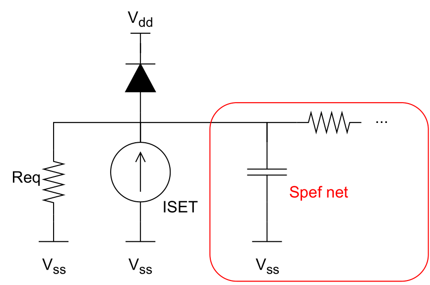{ align=left, width=400 }
    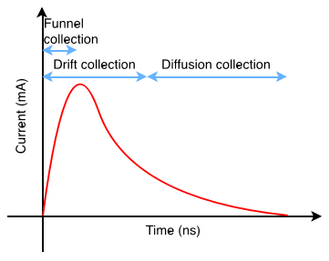{ align=right, width=400 }

=== "Bias Dependent (BIAS) Current Source Model"

    In case of a high LET particle strike, the generated current exceeds the driving current of the restoring transistor, and thus the form of the current pulse may diverge from the double-exponential one. As shown in figure below, the generated current pulse will have a short spike followed by a long plateau zone. The amplitude of the plateau is equal to the driving current of the restoring transistor, while the duration of the plateau increases with teh particle LET.

    The Bias Dependent model can manage the voltage overshoot effect, observed in the Double Exponential model. As illustrated in the figure below, this model implementation comprises a capacitor `Cs`, one independent current source `ISET`, and two voltage-dependent current sources, `GREC` and `GSEE`. The `ISET` is the typical DEXP current source, while the `GREC` and `GSEE` current sources are related to the recombination process and the node voltage variation due to the particle charge. The capacitor `Cs` stores the charge which is equivalent to the SET-induced charge. `GSEE'` is 1-1 with `GSEE` and is connected to driver gatepin's spefnet. Bias-dependent auxiliary net is detached from the driver gatepin's spefnet to avoid external influences that may lead to erroneous charge collection as `Cs`. `GREC` is related to the `Recombination Current` parameter. `GSEE` is dependent on `Cs` voltage and on the driver's node voltage, through the following equation:

    $$
    \begin{align}
    GSEE &= (V(Cs)/tau1) \times (1.0/(1.0 + exp((V(driver) + 3\times F)/F))) \\
    \end{align}
    $$

    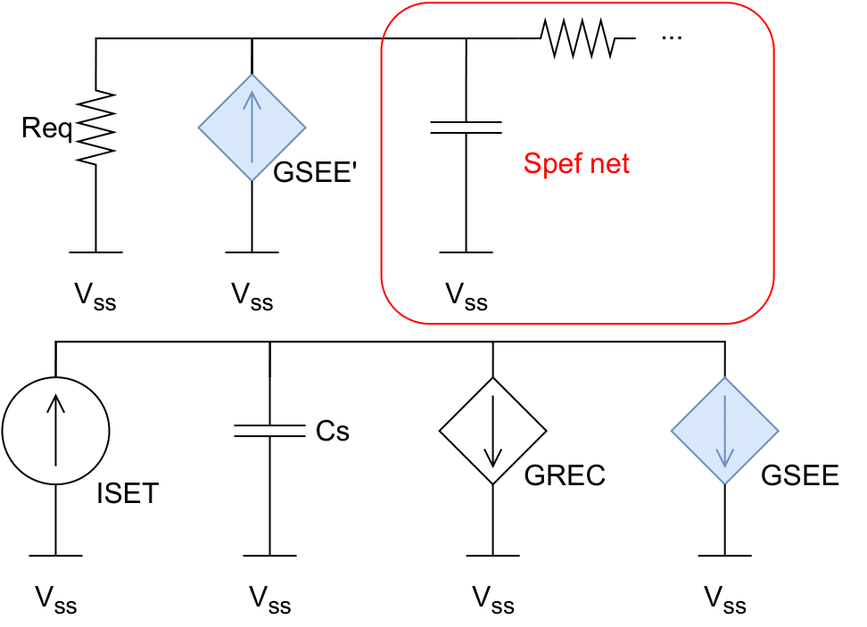{ align=right, width=400 }
    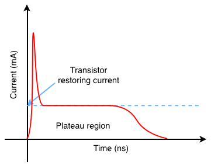{ align=right, width=400 }

#### Glitch Generation

The SET generation model and BIAS model parameters (`Cs`,`Recombination Current`, and `Fermi`) can be specified using the TCL command:

```tcl
%> set_SET_generation_parameters -model <DEXP | BIAS> -biascapacitance <BIAS capacitance> -recomb <recombination current> -fermi <fermi constant>
```

Upon creation of SET scenarios, the SET glitch can be generated for a scenario stored in memory or for all the defined SET scenarios. This can be done using the TCL command:

```tcl
%> generate_SET_glitch (-scenario <scenario_index> | -all) ?-corner <corner_index>?
```

where:

- `-scenario <scenario_index>` is the index of the SET scenario for which the SET glitch is to be generated
- `-all` is used to generate the SET glitch for all the defined SET scenarios
- `-corner <corner_index>` is the index of the library corner to be used for the SET glitch generation

#### Loading Custom Voltage Glitch

Alternative to performing SET generation, UPSET allows the user to perform SET generation in another tool (like SPICE) and store the generated voltage waveforms into a SET scenario. This can be done using the TCL command:

```tcl
%> generate_SET_scenario_custom_glitch -scenario <receivergatepin> {t0 v0 t1 v1 ... tn vn} -corner <corner_index>
```

where:

- `<receivergatepin>` is the name of the receiver gate pin
- `{t0 v0 t1 v1 ... tn vn}` is the list of the voltage waveform timepoints and values.


### SET Glitch Propagation

After the SET glitch generation at the output gatepin of the driver gate, the SET glitches are stored at the connected input gatepins of the receiver gates. The generated SET glitches need to be propagated to the forward logic cone  until they reach the end points, i.e. primary outputs or sequential elements inputs, or become masked either by logical or electrical masking.

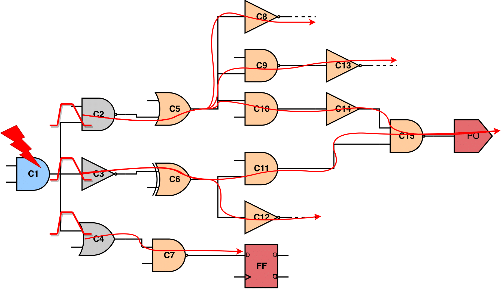
/// caption
Propagation of the generated SETs to the forward logic cone
///

After SET scenarios have been loaded in memory (check [create_SET_scenario](commands_reference.md#create_set_scenario) and [load_SET_scenarios](commands_reference.md#load_set_scenarios) commands), and SET glitch generation has been performed for a specific scenario or for all of them (check [generate_SET_glitch](commands_reference.md#generate_set_glitch) command), then SET propagation can be performed for the scenario that SET generation has been performed or for all of them, using the TCL command:

```tcl
%> propagate_SET_scenario_glitch (-scenario <scenario_index> | -all) ?-corner <corner_index>?
```

where:

- `-scenario <scenario_index>` is the index of the SET scenario for which the SET glitch propagation is to be performed
- `-all` is used to propagate the SET glitch for all the defined SET scenarios
- `-corner <corner_index>` is the index of the library corner to be used for the SET glitch propagation

#### SET Propagation STA-modes

<figure class="inline" markdown>
  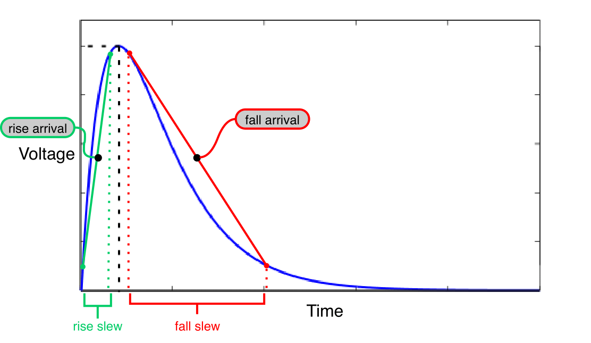
  <figcaption>SET pulse decomposition to its rise and fall arrival times and slews</figcaption>
</figure>

A SET glitch in UPSET is characterised by the arrival time and the slew of its rise and fall edge, as shown in the next . Thus, during the SET glitch propagation, the rise and fall arrival times and slews, stored at the receivers' input gatepins are propagated to the forward logic cone by UPSET's STA engine. UPSET SET propagation supports three STA-modes: (i) *"Vanilla"* STA-mode, (ii) *Detailed TimeStamp-based* STA-mode, and (iii) *Probabilistic* STA-mode.

The SET propagation STA-mode can be set using the TCL command:

```tcl
%> set_SET_glitch_propagation_mode <0: Vanilla STA-mode | 1: Detailed TimeStamp-based STA-mode | 2: Bounded TimeStamp-based STA-mode>
```


##### "Vanilla" STA-mode

The "Vanilla" STA-mode performs MAX analysis without considering the gates' Boolean function. In more detail, after the generation of a SET pulse at the struct gate, the SET pulse will propagate to the forward logic cone, traversing unate (positive or negative) gate and/or binate gates.

As for the unate gates, if the side inputs are not at a controlling logic value, the SET pulse will be propagated to the gate's output pin. The direction of the output SET pulse depends on the direction of the input SET pulse and the unateness of the gate, as shown in the [figure](#tab:unate_gates) below. In case the side input is at the controlling logic value, then the SET pulse is logically masked, and its propagation to the forward logic cone is stopped.

<table id="tab:unate_gates">
<caption><strong>SET Propagation through unate gates</strong></caption>
<thead>
<tr>
<td style="text-align: center;">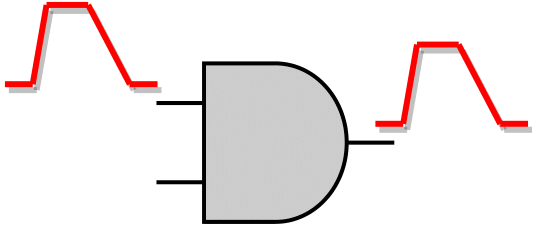<br>SET Propagation through a positive unate gate</td>
<td style="text-align: center;">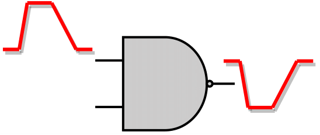<br>SET Propagation through a negative unate gate</td>
</tr>
</thead>
</table>

<figure class="inline end" markdown id="fig:binate_gate">
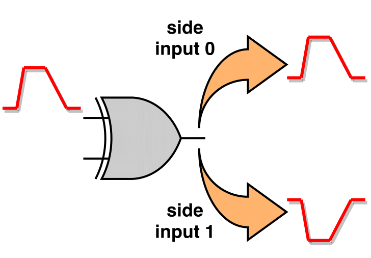
<figcaption>SET propagation through a binate gate results in two independent SET pulses at the output of the gate</figcaption>
</figure>

As for the binate gates, like XOR or XNOR, the gate unateness, and thus the direction of the output SET pulse, depends on the value of the side input. In the "Vanilla" STA-mode, since it doesn't perform Boolean evaluation at the gate level, the value of the side inputs is not considered during the evaluation of the output SET pulse. Thus, as shown in the next [figure](#fig:binate_gates), two SET cases are generated at the output of the gate, one SET with positive direction and one with negative direction.


[Table](#tab:non-reconvergence_vanilla_output_set_pulse_cases) below summarises the output SET pulse cases generated when a SET pulse reaches only one input of a gate (non-reconvergence).


<table id="tab:non-reconvergence_vanilla_output_set_pulse_cases">
<caption><strong>Non-Reconvergence Output SET Pulse Cases for "Vanilla" STA-mode</strong></caption>
<tbody>
<tr>
<td style="text-align: center; vertical-align: middle;"><strong>Positive Unate</strong></td>
 <td style="text-align: center; vertical-align: middle;"></td>
<td style="text-align: center; vertical-align: middle;">1 Output SET Pulse Produced</td>
<td style="text-align: center; vertical-align: middle;">The output SET pulse has the same direction with the input SET pulse</td>
</tr>
<tr>
<td style="text-align: center; vertical-align: middle;"><strong>Negative Unate</strong></td>
 <td style="text-align: center; vertical-align: middle;"></td>
 <td style="text-align: center; vertical-align: middle;">1 Output SET Pulse Produced</td>
 <td style="text-align: center; vertical-align: middle;">The output SET pulse has the opposite direction of the input SET pulse</td>
 </tr>
 <tr>
 <td style="text-align: center; vertical-align: middle;"><strong>Binate</strong></td>
  <td style="text-align: center; vertical-align: middle;">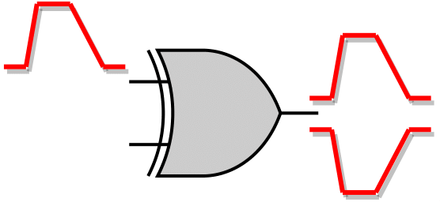</td>
  <td style="text-align: center; vertical-align: middle;">2 Output SET Pulses Produced <sup><a href="#footnote-1">1</a></sup></td>
  <td style="text-align: center; vertical-align: middle;">Regardless the input SET pulse direction, both positive and negative SET pulse will be produced at the output pin</td>
</tbody>
</table>

<div class="footnotes" style="font-size: 12px;">
  <hr />
  <ol>
    <li id="footnote-1"><p>Binate gates produce both <strong>positive</strong> and <strong>negative</strong> SET pulse at the output <strong>due to unknown side input values</strong>.</p>
    </li>
  </ol>
</div>

However, during the SET pulse propagation to the forward logic cone a reconvergence point is likely to be reached. A reconvergence point is a gate where two or more SET pulses reach its input pins from different paths, as shown in the [figure](#fig:reconvergence_point) below.

<figure id="fig:reconvergence_point" markdown>
  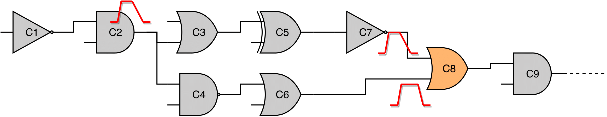
  <figcaption>Gate C8 is a reconvergence point, where two SET pulses reach its input pins, due to the divergence of the original SET pulse at the fan-out of gate C2</figcaption>
</figure>

To propagate the SETs to the output of the reconvergence point the following steps take place:

1. Each SET pulse is propagated separately through the gates, producing a temporal output SET pulse. The produced SET pulse can be either positive or negative, based on the gate unateness and the direction of the input SET pulse.
2. Examine all the positive temporal SET pulses at the output of the gate, if any, and fuse them as a single positive output SET pulse. The produced positive output SET pulse is constructed as the minimum among the rise temporal SET edges (earliest rise edge) and the maximum of the fall temporal SET edges (latest fall edge).
3. Similarly, examine all the negative temporal SET pulses at the output of the gate, if any, and fuse them as a single negative output SET pulse. The produce negative output SET pulse is constructed as the minimum among the fall temporal SET edges (earliest fall edge) and the maximum of the rise temporal SET edges (latest rise edge).

The following [table](#tab:reconvergence_point_output_set_pulse_cases) summarises the output SET pulse cases based on gate unateness and the input SET pulse direction.

<table id="tab:reconvergence_point_output_set_pulse_cases">
<caption><strong>Reconvergence Output SET Pulse Cases for "Vanilla" STA-mode</strong></caption>
<tbody>
<tr>
<td style="text-align: center; vertical-align: middle;" rowspan="2;"><strong>Positive Unate</strong></td>
<td style="text-algin: center; vertical-align: middle;">Same Pulse Directions</td>
<td style="text-algin: center; vertical-align: middle;">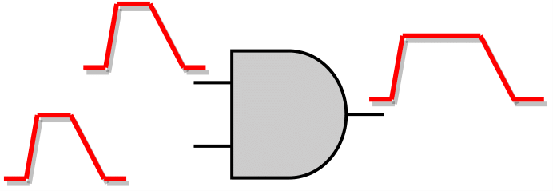</td>
<td style="text-algin: center; vertical-align: middle;">1 Output SET Pulse Produced</td>
<td style="text-algin: center; vertical-align: middle;">Same direction with the input SET pulses</td>
</tr>
<tr>
<td style="text-algin: center; vertical-align: middle;">Opposite Pulse Directions</td>
<td style="text-algin: center; vertical-align: middle;">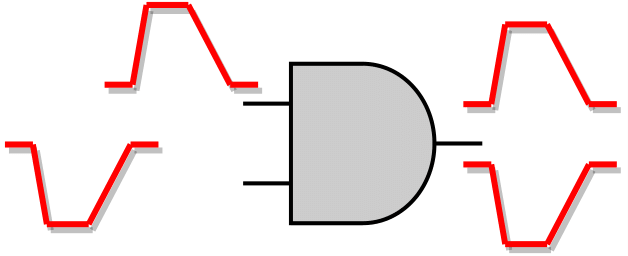</td>
<td style="text-algin: center; vertical-align: middle;">2 Output SET Pulses Produced</td>
<td style="text-algin: center; vertical-align: middle;"><p><li>Positive input SET &#8594; Positive output SET</li><li>Negative input SET &#8594; Negative output SET</li></p></td>
</tr>
<tr>
<td style="text-align: center; vertical-align: middle;" rowspan="2;"><strong>Negative Unate</strong></td>
<td style="text-algin: center; vertical-align: middle;">Same Pulse Directions</td>
<td style="text-algin: center; vertical-align: middle;">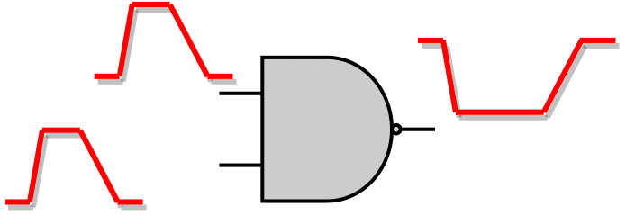</td>
<td style="text-algin: center; vertical-align: middle;">1 Output SET Pulse Produced</td>
<td style="text-algin: center; vertical-align: middle;">Opposite direction with the input SET pulses</td>
</tr>
<tr>
<td style="text-algin: center; vertical-align: middle;">Opposite Pulse Directions</td>
<td style="text-algin: center; vertical-align: middle;">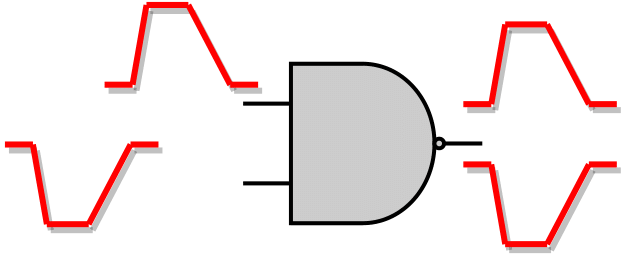</td>
<td style="text-algin: center; vertical-align: middle;">2 Output SET Pulses Produced</td>
<td style="text-algin: center; vertical-align: middle;"><p><li>Positive input SET &#8594; Negative output SET</li><li>Negative input SET &#8594; Positive output SET</li></p></td>
</tr>
<tr>
<td style="text-algin: center; vertical-align: middle;" rowspan="2;"><strong>Binate</strong></td>
<td style="text-algin: center; vertical-align: middle;">Same Pulse Directions</td>
<td style="text-algin: center; vertical-align: middle;">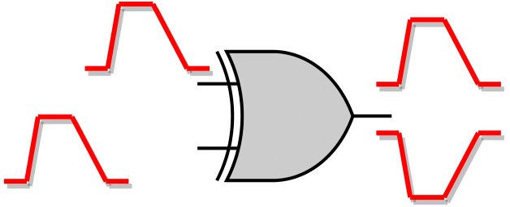</td>
<td style="text-algin: center; vertical-align: middle;">2 Output SET Pulses Produced</td>
<td style="text-algin: center; vertical-align: middle;">Positive & Negative</td>
</tr>
<tr>
<td style="text-algin: center; vertical-align: middle;">Opposite Pulse Directions</td>
<td style="text-algin: center; vertical-align: middle;"></td>
<td style="text-algin: center; vertical-align: middle;">2 Output SET Pulses Produced</td>
<td style="text-algin: center; vertical-align: middle;">Positive & Negative</td>
</tbody>
</table>

##### Detailed TimeStamp-based STA-mode

The "Vanilla" STA-mode even though it is quite fast, the produced SET pulses are not as accurate as those produced by SPICE simulation, especially for reconvergence points. Thus, a more accurate model is required, which is the "Detailed TimeStamp-based STA-mode". In this mode, Boolean evaluation at the gate level is performed, taking into account the arrival time of the SET pulses as well as the Boolean function of the examining gate. It is important to note that this mode **doesn't perform input vectors justification**.

<table id="tab:detailed_time_stamp_based_sta_mode_input_output_combinations">
<caption><strong>Input SET Cases & Possible Output SET Pulse Cases for Detailed TimeStamp-based STA-mode</strong></caption>
<thead>
<tr>
<td style="text-align: center;"><strong>Input SET Cases</strong></td>
<td style="text-align: center;" colspan="2"><strong>Possible Output SET Pulse Cases</strong></td>
</tr>
</thead>
<tbody>
<tr>
<td style="text-align: center;" rowspan="2">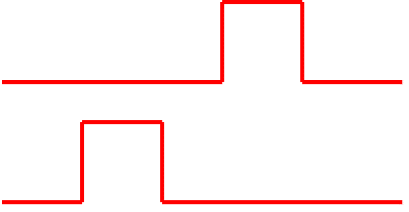</td>
<td style="text-align: center; vertical-align: middle;" rowspan="2"><strong>Logically Masked</strong></td>
<td style="text-align: center; vertical-align: middle;">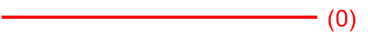</td>
</tr>
<tr>
<td style="text-align: center; vertical-align: middle;">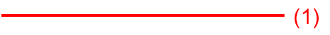</td>
</tr>

<tr>
<td style="text-align: center;" rowspan="2">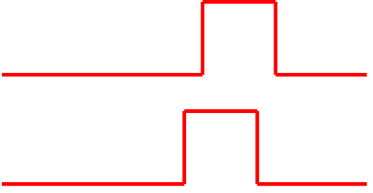</td>
<td style="text-align: center; vertical-align: middle;" rowspan="2"><strong>Intersection of Input SET Pulses</strong></td>
<td style="text-align: center; vertical-align: middle;"></td>
</tr>
<tr>
<td style="text-align: center; vertical-align: middle;"></td>
</tr>

<tr>
<td style="text-align: center;" rowspan="2">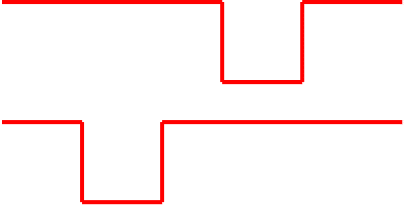</td>
<td style="text-align: center; vertical-align: middle;" rowspan="4"><strong>Union of Input SET Pulses</strong></td>
<td style="text-align: center; vertical-align: middle;"></td>
</tr>
<tr>
<td style="text-align: center; vertical-align: middle;"></td>
</tr>
<tr>
<td style="text-align: center; vertical-align: middle;" rowspan="2">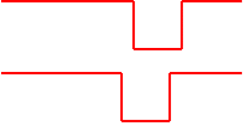</td>
<td style="text-align: center; vertical-align: middle;">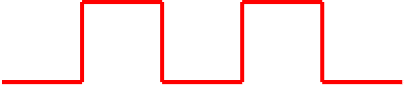</td>
</tr>
<tr>
<td style="text-align: center; vertical-align: middle;">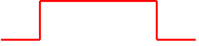</td>
</tr>

<tr>
<td style="text-align: center;" rowspan="2">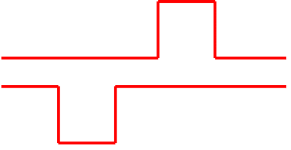</td>
<td style="text-align: center; vertical-align: middle;" rowspan="4"><strong>One Input Pulse Propagates / Other One Masked</strong></td>
<td style="text-align: center; vertical-align: middle;"></td>
</tr>
<tr>
<td style="text-align: center; vertical-align: middle;"></td>
</tr>
<tr>
<td style="text-align: center; vertical-align: middle;" rowspan="2">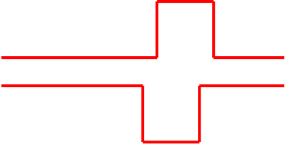</td>
<td style="text-align: center; vertical-align: middle;"></td>
</tr>
<tr>
<td style="text-align: center; vertical-align: middle;"></td>
</tr>
</tbody>
</table>

The main difference of this mode compared to the "Vanilla" STA-mode lies in the handling of the reconvergence. As mentioned, "Vanilla" STA-mode considers each arriving SET pulse separately and performs MAX analysis among all possible temporal output pulses, propagating a single pessimistic output SET pulse. In contrast, in the Detailed TimeStamp-based STA-mode, Boolean evaluation is performed considering the arrival times of the input SET pulses propagating a more realistic SET pulse, compared to "Vanilla". In any other case, i.e. no reconvergence, both Detailed and "Vanilla: mode operate in the same way. A more thorough illustration for Detailed mode is presented in the above [table](#tab:detailed_time_stamp_based_sta_mode_input_output_combinations); Each combination of input pulses, presented in the left column, produce an output SET pulse which shape is based on the Boolean function of the examining gate and can be one of those presented on the right side.

##### Bounded TimeStamp-based STA-mode

<figure class="inline end" markdown id="fig:bounded_timestamp_based_sta_mode_output_set_pulse">
  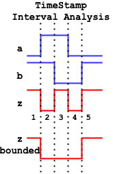
  <figcaption>SET output pulse produced by the bounding technique</figcaption>
</figure>

However, the Detailed TimeStamp-based interval analysis, as shown in the above [table](#tab:detailed_time_stamp_based_sta_mode_input_output_combinations), can produce a "train" of multiple pulses which will be propagated to the forward logic cone. Such a pulse "train" can reach another reconvergence point and produce even more pulses, increasing that way the number of timestamp and, thus, the overall runtime of the SET propagation. Therefore, the Bounded TimeStamp-based STA-mode is introduced as a means to speed up the TimeStamp-based interval analysis while achieving at the same time a better accuracy compared to the "Vanilla" STA-mode. In the Bounded STA-mode, the timestamp analysis of the above [table](#tab:detailed_time_stamp_based_sta_mode_input_output_combinations) is performed, but the possible output SET pulse(s) that the Detailed mode would produce are now an intermediate result. The output SET pulse is a single pulse (a single pair of rise and fall edges) constructed by the earliest and latest edge of the individual smaller pulse of the "train", as shown in the next [figure](#fig:bounded_timestamp_based_sta_mode_output_set_pulse). Thus, a pulse "train" is never propagated to the forward logic cone, reducing the execution time of the TimeStamp-based interval analysis compared to the Detailed TimeStamp-based STA-mode.

### Masking Mechanisms

The propagation of a SET pulse may stop due to the existence of the three masking mechanisms: (i) Logical, (ii) Electrical, and (iii) Timing-Window Masking.

#### Logical Masking

<figure class="inline end" markdown id="fig:logical_masking">
  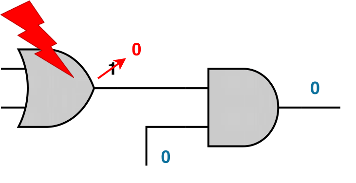
  <figcaption>Logical Masking</figcaption>
</figure>

Logical Masking occurs when a SET pulse arrives at an input of a gate and its propagation stops because one of the side input is at a controlling logic value, or the values of the side inputs doe not allow the SET arriving at the input of the gate to propagate to the output. That way, the SET pulse is filtered and the output of the gate will remain at its nominal value.

For logical masking to be supported, the current state of the circuit must be specified. In Vector-based SET analysis, this can be done by creating a case analysis giving values to gatepins, while in Probabilistic SET analysis this can be done by annotating the gatepins with their static probabilities, either by loading a SAIF file or using the 0-Algorithm. More information about the circuit state definition refer to the section [Circuit State Definition](#circuit-state-definition). Moreover, a SET probability lower threshold exists that determines whether the propagated pulse to the output is logically masked.

#### Electrical Masking

Electrical masking occurs due to the parasitic capacitance and resistance of the subsequent gate in the sensitised path, as well as the wire load effect, attenuating the generated SET pulse.
Attenuation of a SET pulse results in a non full-swing signal, i.e. 0 &#8594; Vdd / Vdd &#8594; 0, something that is not supported natively by the STA engine.

<figure markdown>
  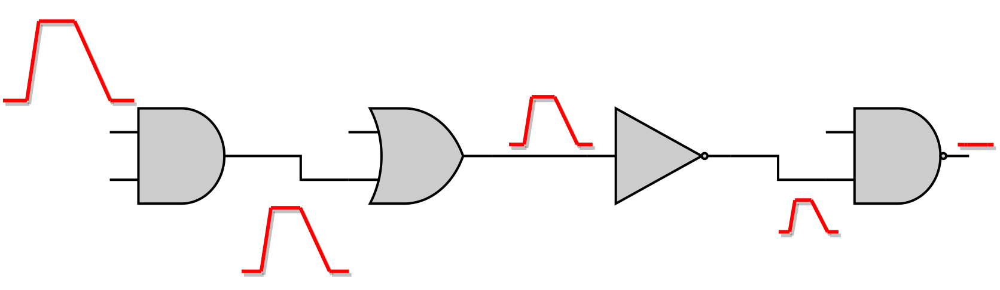
  <figcaption>Electrical Masking</figcaption>
</figure>

To detect if a SET pulse becomes electrically masked as it is propagated through the forward logic cone, the pulse width (`PW`) is checked. The latter is computed as shown in the [figure](#tab:electrical_masking) below, based on the rise and fall arrival times, which are related to the Vth amplitude of each edge.

<table id="tab:electrical_masking">
<caption><strong>Detection by STA engine if a SET pulse is electrically masked</strong></caption>
<thead>
<tr>
<td style="text-align: center;">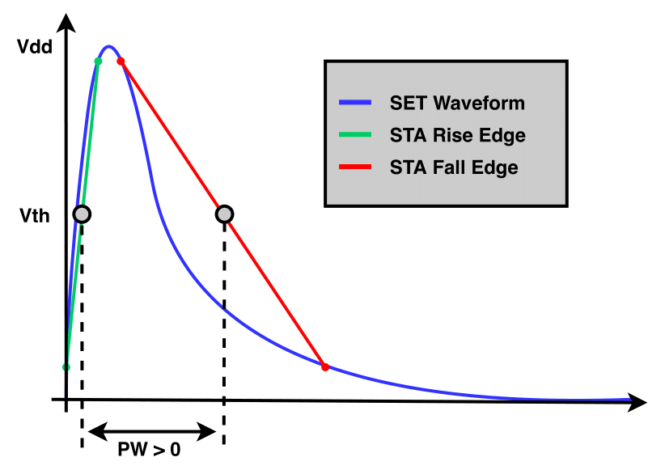<br>Not Electrically Masked SET Pulse</td>
<td style="text-align: center;">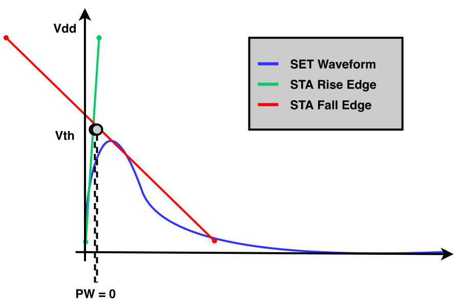<br>Electrically Masked SET Pulse</td>
</tr>
</thead>
</table>

In case the SET pulse width is positive ([left](#fig:non_electrically_masked) figure above), then the SET pulse is not electrically masked and the SET pulse propagation continues. Otherwise, the SET pulse is electrically masked, as shown in the [right](#fig:electrically_masked) figure above, and the propagation is terminated.

#### Timing-Window Masking

<figure class="inline end" markdown id="fig:timing_window_masking">
  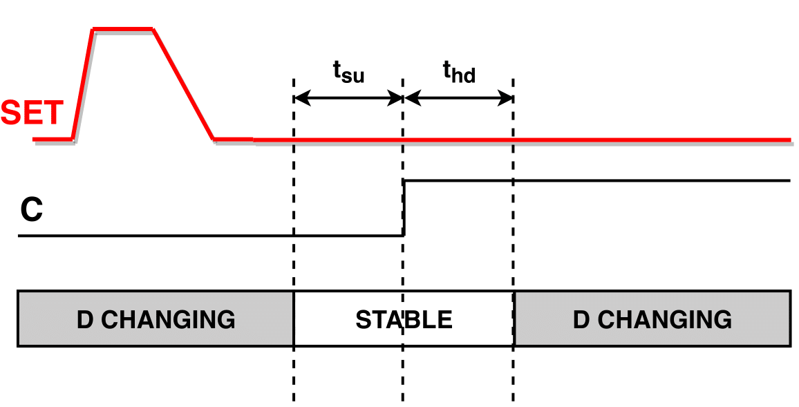
  <figcaption>Timing-Window Masking</figcaption>
</figure>

Nonetheless, logical and electrical masking may not be able to filter the SET pulse, and the latter may be able to reach a sequential element. Timing-window masking occurs when a SET pulse reaches the input of a sequential element but outside the [`SETUP`, `HOLD`] window during which the sequential element captures the input data, and thus this SET is ignored.

Timing-Window masking occurs due to the temporal randomness of the particle strike time and the realisation that the pulse arrival time at the latch has to be within the latching window for the error to occur. In section [Probabilistic Timing-Window Masking](#probabilistic-timing-window-masking) more details on the supported model of the timing-window masking are provided.

## SET Probabilities Computation

As mentioned in section [Logical Masking](#logical-masking), the SET propagation continues until the side input values of the reaching gate filter out the incoming fault. This requires the nominal state of the circuit, which is specified directly in the Vector-based SET Analysis. However, in Probabilistic SET Analysis the static probabilities are extracted after teh circuit simulation for the target application. These probabilities provide a general understanding onf the circuit's state, indicating the probability of each gate being at logic-1 or logic-0. Thus, as each gatepin in the circuit is associated with a probability, the SET generation and propagation can also be linked with a probability ($P_{SET}$).

### Initial SET Probability

Generating a SET pulse at the output of the target gate requires the latter to be in the appropriate state. Thus, generating a positive SET requires the target gate's output to be at logic-0; otherwise, the SET would not be observable. Similarly, this principle applies to the generation of negative SET pulses. That way, the initial SET probability is equal to its static probability $P_0(G_i)$ for a positive SET generation at the gate $G_i$, and its static probability $P_1(G_i)$ for a negative SET generation at the gate $G_i$, as shown in the following equation:

$$
P^{init}_{SET}(G_i) = 
\begin{cases}
\text{P}_0\text{(G}_\text{i}\text{),} &\quad\text{positive SET pulse generation} \\
\text{P}_1\text{(G}_\text{i}\text{),} &\quad\text{negative SET pulse generation} \\
\end{cases}
$$

### Non-Reconvergence Case

After the SET generation at the output of the gate, it is propagated to the forward logic cone. As the SET pulse traverses through subsequent gates, its SET probability must be updated to reflect the probability of the SET pulse occurring at the gate's output. When a single (**non-reconvergence**) SET arrives at the input of a gate, then the SET propagates to the output of the gate **only** when the side inputs values do not filter the fault. Thus, the SET probability at the output of the reached gate $G_i$ can be computed as:

$$
P_{SET}(G_i/out) = P_{SET}(G_i/\alpha) \times \sum_{m \in M(\alpha)} P_{side}(m)
$$

, with $G_i/\alpha$ being the input pin of gate $G_i$, where the SET pulse arrives with probability $P_{SET}(G_i/\alpha)$. As for the sum $\sum_{m \in M(\alpha)} P_{side}(m)$, $M(\alpha)$ is the set of the side inputs values combinations, in the canonical form of minterms, that allow the SET to propagate to $G_i$'s output, and $P_{side}(m)$ is the probability for each combination. 
An example with a positive SET pulse reaching an AND gate is shown in the [figure](#fig:non-reconvergence-set-prob) below.

<figure markdown id="fig:non-reconvergence-set-prob">
  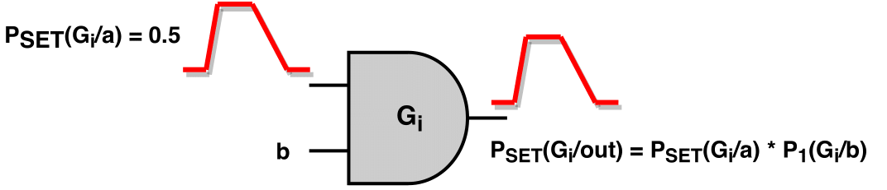
  <figcaption>Output SET Probability for a positive SET pulse reaching an AND gate</figcaption>
</figure>

### Reconvergence Case

In the case of reconvergence, the computation of the SET probability at the output of the gate depends on the STA-mode used for the SET propagation (similar to the shape of the output SET pulse).

#### SET Probability Computation in "Vanilla" STA-mode

As mentioned in section ["Vanilla" STA-mode](#vanilla-sta-mode), "Vanilla" STA-mode is the fastest but also the most pessimistic mode among the other STA-modes. Thus, since the produced output SET pulse is the worst case pulse, its SET probability must also be the worst case.

In general, in this mode, two output SET pulses can be produced, i.e. a positive one and a negative one. Each input SET pulse is considered separately, producing one or two pulses at the output based on the gate unateness, as shown in this [table](#tab:reconvergence_point_output_set_pulse_cases).

As for the shape of a positive SET pulse, MAX analysis is performed among the intermediate positive SET pulses, and it is constructed by the earliest rise and latest fall edge (as described in section ["Vanilla" STA-mode](#vanilla-sta-mode)).
As for the corresponding SET probability, once more, MAX analysis is performed among the probabilities of the input SET pulses producing an intermediate positive SET pulse. Based on this SET pulse, the side input values propagating this SET pulse to the output are extracted and the final output SET probability for the positive SET pulse is:

$$
P^{POS}_{SET}(out) = P_{SET}(I) \times \sum_{m \in M(I)} P_{side}(m)
$$

where $P_{SET}(I) = \max \{P^{pos}_{SET}(i_1), ..., P^{pos}_{SET}(i_n)\}$ is the probability of SET pulse $I$, which is the one with the maximum probability among those producing a positive SET pulse at the output of the gate. Similarly to the non-reconvergence case, the $\sum_{m \in M(I)} P_{side}(m) $ is the accumulated probability of all side input values combinations propagating to the output from the input SET pulse $I$. Similarly, based on the same principles, the probability of a negative output SET pulse can be computed.

<figure markdown id="fig:vanilla_reconv_set_prob">
  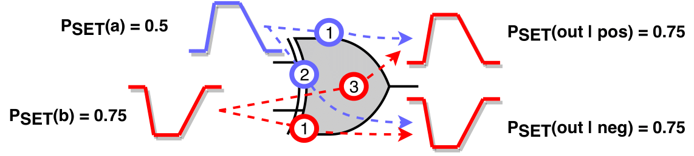
  <figcaption>Reconvergence of two SET pulses with different directions at a XOR gate</figcaption>
</figure>

An example is provided in the [figure](#fig:vanilla_reconv_set_prob) to clarify the aforementioned computation method, demonstrating the reconvergence of two SET pulses with different directions at a XOR gate. The SET probabilities for the pulses are $P_{SET}(\alpha) = 0.5$ and $P_{SET}(b) = 0.75$, respectively. Each input SET pulse is handled separately.

- Positive SET pulse at input pin $\alpha$: Since the SET reaches a binate gate, it produces a positive intermediate SET pulse through the positive unate arc (1) and a negative one through the negative unate arc (2).
- Negative SET pulse at input pin $b$: Since the SET reaches a binate gate, it produces a positive intermediate SET pulse through the negative unate arc (3) and a negative one through the positive unate arc (4).

Finally, at the output of the XOR gate, two SET pulses will be produced:

- a positive one, after performing MAX analysis among intermediate pulses (1) and (3), with SET probability $P_{SET}(out|pos) = \max \{P_{SET}(\alpha), P_{SET}(b)\} = 0.75$, and
- a negative one, after performing MAX analysis among intermediate pulses (2) and (4), with SET probability $P_{SET}(out|neg) = \max \{P_{SET}(\alpha), P_{SET}(b)\} = 0.75$

#### SET Probability Computation in Detailed TimeStamp-based STA-mode

In contrast to "Vanilla" STA-mode, where MAX analysis is performed for the computation of the output SET probability, in the Detailed TimeStamp-based mode the output SET pulse probability depends on the output pulse case (presented in this [table](#tab:detailed_time_stamp_based_sta_mode_input_output_combinations)) based on which the output SET is constructed. The following [table](#tab:detailed_set_prob_computation) presents the equations for the computation of the output SET pulse probability for each output pulse case.

<table markdown id="tab:detailed_set_prob_computation">
<caption><strong>Detailed TimeStamp-based STA-mode Output SET Probability Computation</strong></caption>
<thead>
<tr>
<th style="text-align: center; vertical-align: middle;" colspan="2">Output SET Pulse Case</th>
<th style="text-align: center; vertical-align: middle;">Example</th>
<th style="text-align: center; vertical-align: middle;">Output SET Probability</th>
</tr>
</thead>
<tbody>
<tr>
<td style="text-align: center; vertical-align: middle;" colspan="2">Logically Masked</td>
<td style="text-align: center; vertical-align: middle;">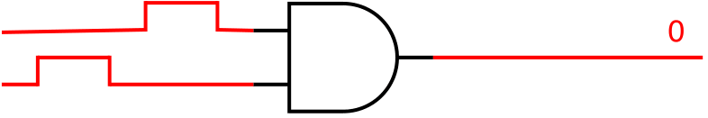</td>
<td style="text-align: center; vertical-align: middle;">$$P_{SET}(out)=0$$</td>
</tr>

<tr>
<td style="text-align: center; vertical-align: middle;" colspan="2">Intersection of Input SET Pulses</td>
<td style="text-align: center; vertical-align: middle;">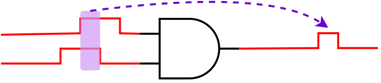</td>
<td style="text-align: center; vertical-align: middle;">$$P_{SET}(out)=P_{SET}(\alpha) \times P_{SET}(\beta)$$</td>
</tr>

<tr>
<td style="text-align: center; vertical-align: middle;" rowspan=2>Union of Input SET Pulses</td>
<td style="text-align: center; vertical-align: middle;">Non-Overlapping</td>
<td style="text-align: center; vertical-align: middle;">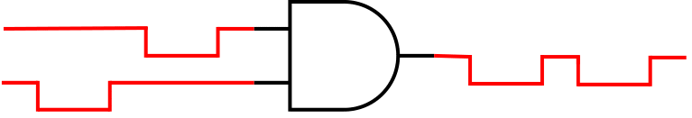</td>
<td style="text-align: center; vertical-align: middle;" rowspan="2">$$P_{SET}(out)=max\{P_{SET}(\alpha),P_{SET}(\beta)\}$$</td>
</tr>
<tr>
<td style="text-align: center; vertical-align: middle;">Overlapping</td>
<td style="text-align: center; vertical-align: middle;">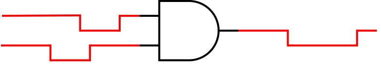</td>
</tr>

<tr>
<td style="text-align: center; vertical-align: middle;" rowspan=2>One Input SET Pulse Propagates / Other One Gets Masked</td>
<td style="text-align: center; vertical-align: middle;">Non-Overlapping</td>
<td style="text-align: center; vertical-align: middle;">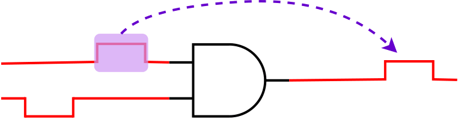</td>
<td style="text-align: center; vertical-align: middle;" rowspan="2">$$P_{SET}(out)=P_{SET}(pulse_{propagated})$$</td>
</tr>
<tr>
<td style="text-align: center; vertical-align: middle;">Overlapping</td>
<td style="text-align: center; vertical-align: middle;">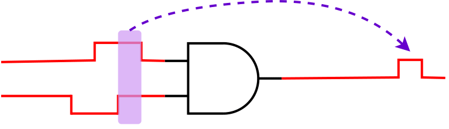</td>
</tr>
</tbody>
</table>

The above equations compute the output SET probability considering only the input SET pulses and not the side inputs values. Thus, to compute the final output SET probability, the latter is multiplied with the probability of side input combinations allowing the produced SET pulse to appear at the output of the gate (similarly with the equation in section [Non-Reconvergence Case](#non-reconvergence-case)).

#### SET Probability Computation in Bounded TimeStamp-based STA-mode

As for the Bounded TimeStamp-based STA-mode, the only difference with the Detailed one, is that instead of producing pulse trains at the output of the gate, it creates a unified pulse constructed by the earliest and latest edge of the train, as shown in this [figure](#fig:timing_window_masking). As for the computation probability of the output SET pulse, the equations of the Detailed mode are still valid for the Bounded mode. 

### Probabilistic Timing-Window Masking

Concluding the phase of the SET propagation the SET pulse might reach some sequential elements of the circuit. To compensate with the probabilistic nature of UPSET's SET propagation, the latching probability of the SET pulse $P_{Latched SET}(E_i)$ arriving at an endpoint pin $E_i$ (PO or sequential output) is defined as:

$$
P_{Latched SET}(E_{i}) = P_{SET}(E_{i}) \times \frac{PW - W_{Latching}}{P_{clock}}
$$

, with $P_{SET}(E_{i})$ the SET pulse probability at $E_{i}$, $PW$ pulse width time duration of the examined SET, while $W_{Latching}$ is the latching timing window at $E_{i}$ and $P_{clock}$ is the period of the related clock.


