# SET-driven Optimisation Techniques

After a complete SET analysis, several techniques can be used to optimise the circuit sensisitivity to the SETs. A brief description of each technique is presented in the following sections. 

## Pin Assignment / Rewiring

Pin assingment / rewiring is a technique used in logic synthesis to improve the circuit power and performance by taking advantage of the functional equivalence of input pins of logic gates. For example, for a NAND gate, as shown in the next [figure](#fig:rewiring), the output evaluates to logic-1 whenever one of its inputs is in logic-0, regardless of the input pin (A or B). This symmetric behaviour is observed in all 2-input basic standard cell gates. As each input pin of a logic gate presents different electrical characteristics depending on the transistor network, they will have different effects on the SET propagation through this pin. Candidate gates for pin assignment are those gates that present an imbalance in broadening characteristics between their timing arcs as well as an imbalance in the PWs of the arriving SET pulses at their input pins.

<figure id="fig:rewiring" markdown>
  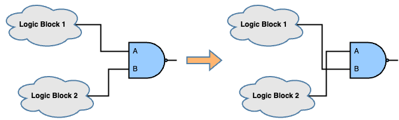
  <figcaption>Pin Assignment / Rewiring for a logic gate</figcaption>
</figure>

To perform rewiring for a target gate in UPSET, the following TCL command can be used:

```tcl
%> eco_swap_component_pins <gatepin name 1> <gatepin name 2>
```

where the two gatepins to be swapped are specified by their names. The gatepin name has the format component_name/pin_name.

## Gate Resizing

The most popular gate-level SET mitigation technique is symmetric gate resizing, i.e. replacement of a smaller gate by a larger one, as shown in the next [figure](#fig:gate_resize). Sizing up a gate increases the effective capacitance of the device thereby making it less likely that the injected SET transient current to cuase a voltage glitch of sufficient magnitude. As a result, the gate will have a lower probability of generating a SET due to a direct particle strike.

<!-- TODO: Create the following figures on our own -->
<table id="tab:gate_resizing_generation">
<caption><strong>Effect of Gate Resizing on SET Generation</strong></caption>
<thead>
<tr>
<td style="text-align: center; width: 400px">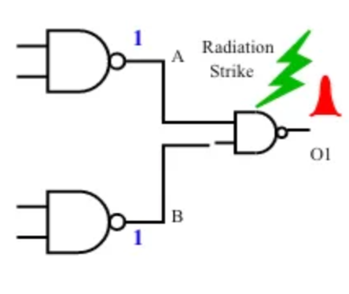<br>Generation of a SET pulse at the output of the gate before resizing.
<td style="text-align: center; width: 400px">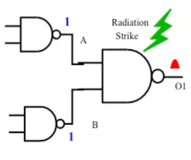<br>Generation of a SET pulse at the output of the gate after resizing. The amplitude of the generated SET pulse is sufficiently reduced</td>
</tr>
</thead>
</table>

However, upsizing a gate will result in higher drive strength which allows for better propagation of input SET transient at the gate. This behaviour is summarised the following [figure](#fig:gate_resize_gen_prop). Thus, applying gate resising must be carefully applied, as it may degrage the SET hardness of the circuit.

<figure id="fig:gate_resize_gen_prop" markdown>
  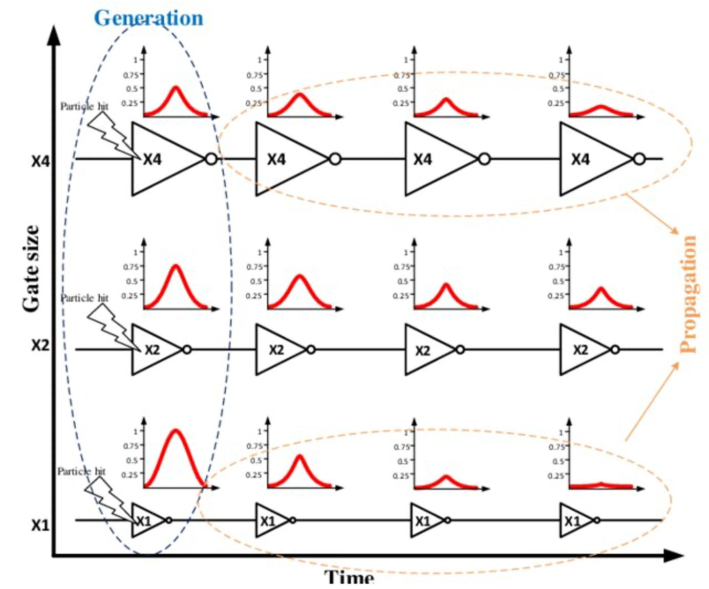
  <figcaption>Effect of Gate Resizing on SET Generation and Propagation</figcaption>
</figure>


To perform gate resizing for a target gate in UPSET, the user can either upsize or downsize a gate to the immediate next larger or smaller gate, respectively. To upsize or downsize a gate, the following TCL command can be used:

```tcl
%> eco_upsize_component <component name> ?-overlapsmethod <1 | 2 | 3>?
or 
%> eco_downsize_component <component name> ?-overlapsmethod <1 | 2 | 3>?
```

, where the target component to be upsized or downsized is specified. The user can also specify the overlap handling method, which can be one of the following:

| Overlap Handling Method | Description |
| ----------------------- | ----------- |
| 1 (default)             | Remove from rows and mark as illegal only the overlapping components |
| 2                       | Remove from rows and mark as illegal both the resized and the overlapping components |
| 3                       | Remove from rows and mark as illegal only the resized component |

The overlap handling method is optional and if not specified, the default overlap handling method is used.

## Insertion of Charge-Sharing Logic

Since the SET is a temporal charge-induced event, increasing the output capacitance of the logic gate can reduce the susceptibility of the logic gate to SETs. One way of achieving that is by connecting redundant logic to its output, as shown in the next [figure](#fig:insertion_of_charge_sharing_logic). Insertion of redundant logic increases the gate's output capacitance and, thus, facilitates the dissipation og particle-induced charge, and enhances the SET electrical filtering. The redundant logic can be implemented by a few inverters, buffers or other gates whose inputs are connected to the target node, while their outputs are left to float or connected to the ground GND. The insertion of charge-sharing logic is complementary to gate resizing with the difference that increases only the capacitance of the output node and, thus, affects the subsequent logic cone without affecting the predecessor interconnects, as the input pins loads remain the same. Candidate gates for inserting charge-sharing logic can ve those that present a high broadening factor (since the broadening occurs due to load imbalance between subsequent gates) as well as those that have large maximum PW at their outputs.

<figure id="fig:insertion_of_charge_sharing_logic" markdown>
  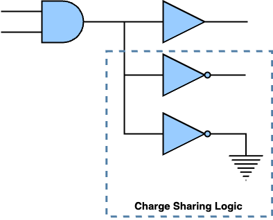
  <figcaption>Insertion of charge-sharing logic composited by INVs</figcaption>
</figure>

To insert charge-sharing logic to a target gate in UPSET, the following TCL command can be used:

```tcl
%> eco_charge_sharing <target gatepin> -cell <delay cell> -num <number of delay cells> ?-placementmethod <0 (Default Placement) | 1 (Place in the centre-of-mass) | 2 (Place in the centre-of-mass and remove overlapping components)>?
```

where the gatepin of the target gate to insert charge-sharing logic is specified and also the number and type of delay cells (libcell name as specified in the library) to be used. Finally, optionally the placement method can be specified. The placement method can be one of the following:

| Placement Method | Description |
| ---------------- | ----------- |
| 0  (default)     | Place the new components at (0, 0) |
| 1                | Place the new components at the centre of mass |
| 2                | Place the new components at the centre of mass and remove overlapping components |

The placement method is optional and if not specified, the default placement method is used.

## Fan-out Decomposition

An alternative approach to the insertion of charge-sharing logic, which aims to increase the load of a target gate in order to achieve SET sensitivity reduction, is to reduce the output load of the gate by performing fan-out decomposition in order to balance it across the levels. One way to achieve this is by performing gate duplication. As shown in the following [figure](#fig:fan_out_decomposition), the target gate is duplicated with the inputs of the two clones eing tied together, while the fan-out of the target gate is split into the two clones. After gate cloning, each clone has a lower output load compared to the initial load of the target gate making it more susceptible to direct particle strikes. However, each SET pulse generated at each one of the replicas by direct partice strike affects fewer endpoints. Moreover, by reducing the output load for the targe gate with fan-out decomposition, the output load of the predecessors gets increased since the clone is added to their fan-outs, which might result in a load imbalance between predecessors and the clones increasing the probability of observing broadening effects.

<figure id="fig:fan_out_decomposition" markdown>
  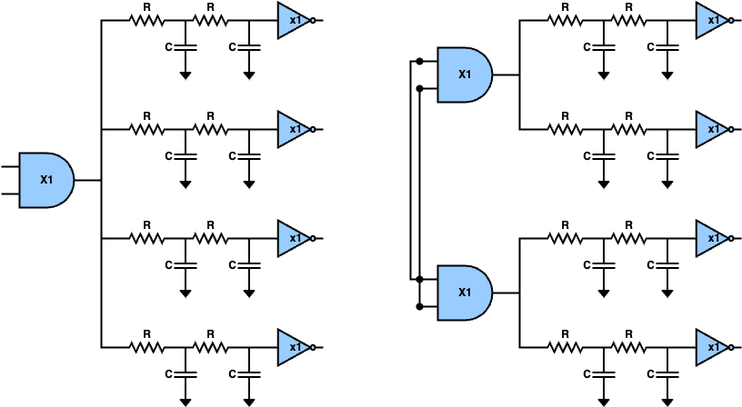
  <figcaption>Fan-out Decomposition by performing gate cloning</figcaption>
</figure>

To perform fan-out  decomposition in UPSET, the following TCL command can be used:

```tcl
%> eco_fanout_decomposition <target component> ?-placementmethod <0 (Default Placement) | 1 (Place in the centre-of-mass) | 2 (Place in the centre-of-mass and remove overlapping components)>?
```

where the component of which the fan-out will be decomposed is specified. Finally, optionally the placement method can be specified. The placement method can be one of the following:

| Placement Method | Description |
| ---------------- | ----------- |
| 0  (default)     | Place the new components at (0, 0) |
| 1                | Place the new components at the centre of mass |
| 2                | Place the new components at the centre of mass and remove overlapping components |

The placement method is optional and if not specified, the default placement method is used.


## Triple Modular Redundancy (TMR)

Another technique to reduce the SET sensitivity of critical nodes is by introducing redundancy at teh gate level. One of the most commong methods is the Triple Modular Redundancy (TMR), where the target gate is triplicated with the inputs of each replica being tied together and their outputs connected to a majority voter. Also, a delay is added to 2 out of the 3 replicas ($\delta$ and $2\delta$), as shown in the [figure](#fig:tmr) below, in order to filter the incoming SET pulses and thus the TMR to be able to filter the fault. 

<figure id="fig:tmr" markdown>
  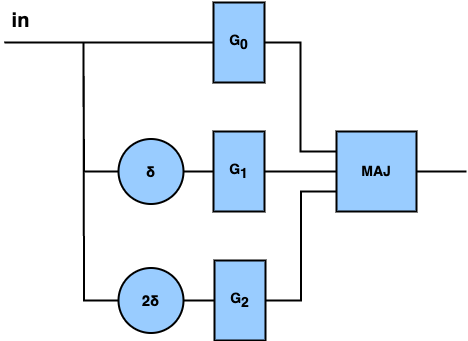
  <figcaption>Triple Modular Redundancy</figcaption>
</figure>

!!! warning
    Current version of UPSET does not add the delays to the 2 out of the 3 replicas of the TMR, which protects the TMR from propagated SETs. This will be supported in the next version of UPSET.

However, the TMR introduces significant power, performance and area overhead and also inserts extra gates to the circuit, which are potential additional target gates for SET generation, as shown in the following [figure](#fig:tmr_voter_target). So, the TMR would be the last mitigation technique to be applied if the rest are not able to achieve significant SET sensitivity reduction.

<!-- TODO: Create the following figure on our own -->
<figure id="fig:tmr_voter_target" markdown>
  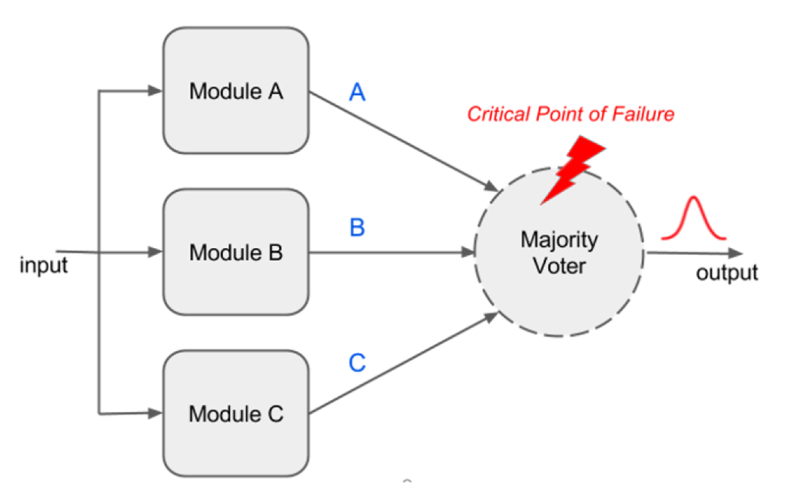
  <figcaption>The majority voter is a new target gate for SET generation</figcaption>
</figure>

To apply TMR to a target gate, the following TCL command is used:

``` tcl
%> eco_tmr_component <compoent_name> ?-placementmethod <0 (Default Placement) | 1 (Place in the centre-of-mass) | 2 (Place in the centre-of-mass and remove overlapping components)>?
```

, where the user must specify the name of the target gate to be TMR'ed and the placement method to be used. The placement method can be one of the following:

| Placement Method | Description |
| ---------------- | ----------- |
| 0  (default)     | Place the new components at (0, 0) |
| 1                | Place the new components at the centre of mass |
| 2                | Place the new components at the centre of mass and remove overlapping components |

The placement method is optional and if not specified, the default placement method is used.

As for the majority voter, the following architecture is used by UPSET:

<figure id="fig:majority_voter" markdown>
  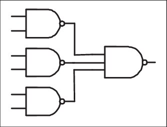
  <figcaption>Majority Voter composed by 4 NAND gates</figcaption>
</figure>

## Insertion of SET Filter

The insertion of SET filters in the circuit is another technique that aims to reduce the maximum pulse width that is observed at a target node of the circuit. The structure of a SET fulter is shown in the following [figure](#fig:set_filter), where the output of the target gate is connected to a delay line and a guard gate. The SET filter is able to filter any SET pulse with PW less than or equal to the added $\Delta$ delay, due to the reconvergence in the guard gate. Moreover, for SETs with PWs greater than the inserted delay, even though it is not able to filter it completely, it reduces its PW by an amount equal to $\Delta$. However, since the SET filtering adds extra delay in the second path, this approach increases the delay of the related path. To efficiently use the SET filter insertion, the target gates where the SET will be applied as well as the amount of delay to be inserted must be considered carefully. Finally, the SET filter inserts extra gate to the circuit and especially the guard gate which is a potential additional target gate for SET generation.

<figure id="fig:set_filter" markdown>
  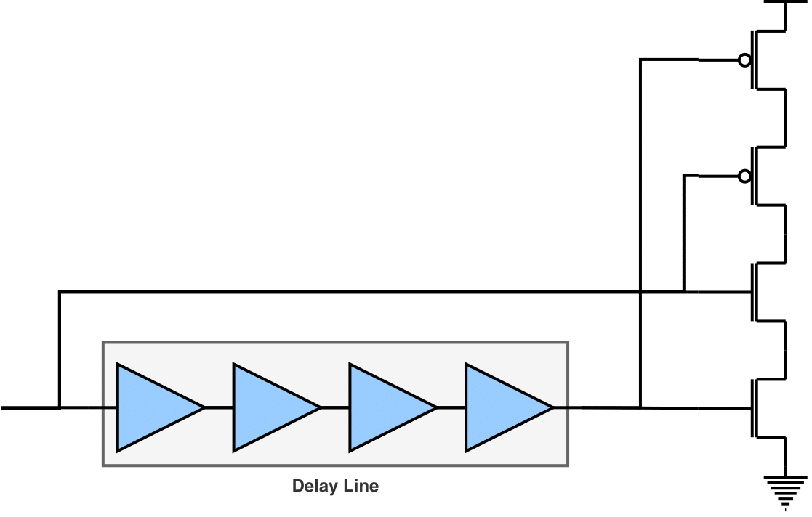
  <figcaption>Insertion of SET Filter</figcaption>
</figure>

To insert a SET filter at the output of a target gate in UPSET, the following TCL commandd is used:

```tcl
%> eco_insert_filter <target gatepin> -cell <delay cell> -num <number of delay cells> -AND <AND cell> ?-placementmethod <0 (Default Placement) | 1 (Place in the centre-of-mass) | 2 (Place in the centre-of-mass and remove overlapping components)>?
```

where the gatepin of the target gate to insert a SET filter is specified and also the delay cell (libcell name as specified in the library) as well as the AND gate for the voting to be used for the SET filter. Finally, optionally the placement method can be specified. The placement method can be one of the following:

| Placement Method | Description |
| ---------------- | ----------- |
| 0  (default)     | Place the new components at (0, 0) |
| 1                | Place the new components at the centre of mass |
| 2                | Place the new components at the centre of mass and remove overlapping components |

The placement method is optional and if not specified, the default placement method is used.

!!! bug
    The current version of SET filter insertion is supporting the insertion of an AND gate for the voting, instead of a guard gate. However, this is not correct, since the AND gate will result in broadening negative (1->0->1) SET pulses instead of attenuating them. Thus, the SET filter insertion should be updated to support the insertion of a guard gate in the next release.


## Insertion of Cascaded Inverters

Alternative to the insertion of SET filters, SET filtering can be achieved by inserting cascaded inverters in a logic path, where the second inverter is significantly larger compared to the first one,  as shown in the [figure](#fig:cascaded_inverters) below. Reducing the difference in the drive strengths between the cascaded inverters weakens the filtering capability. However, on the other hand, increasing the difference in the drive strenghts between them increase the overhead introduced both in power and delay. Instead or two cascaded inverters, a standard buffer from the library could bbe used, however, they often are composed of two inverters where the one inverter is x2-x3 larger than the other one and, thus, they are not sufficient for SET filtering. 

<figure id="fig:cascaded_inverters" markdown>
  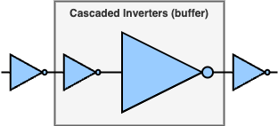
  <figcaption>Insertion of Cascaded Inverters for SET filtering</figcaption>
</figure>

To add cascaded inverters to the output of a target gate in UPSET, the following TCL command can be used:

```tcl
%> eco_insert_cascaded_inverter <target gatepin> -cells <cell 1> <cell 2> ?-placementmethod <0 (Default Placement) | 1 (Place in the centre-of-mass) | 2 (Place in the centre-of-mass and remove overlapping components)>?
```

where the gatepin of the target gate to insert cascaded inverters is specified and also the two INV cells (libcell name as specified in the library) to be used for the cascaded inverters. Finally, optionally the placement method can be specified. The placement method can be one of the following:

| Placement Method | Description |
| ---------------- | ----------- |
| 0  (default)     | Place the new components at (0, 0) |
| 1                | Place the new components at the centre of mass |
| 2                | Place the new components at the centre of mass and remove overlapping components |

The placement method is optional and if not specified, the default placement method is used.


# SET Analysis & Optimisation Flow

The SET analysis and optimisation flow is presented in the following figure.

<figure id="fig:set_analysis_optimisation_flow" markdown>
  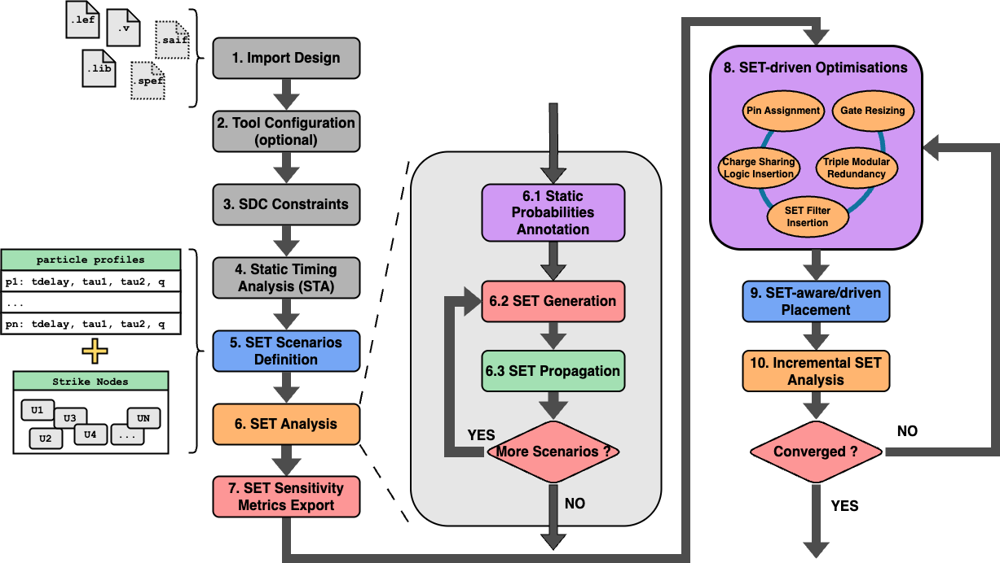
  <figcaption>SET Analysis & Optimisation Flow</figcaption>
</figure>

It is important to note that each SET mitigation technique might result in an illegal placement state. To resolve this, the user can perform legalisation wheneever he wants by using the TCL command:

```tcl
%> legalise_components -order <0 (all) | 1 (increasing) | 2 (decreasing) | 3 (centre-outwards)> -blockagesmethod <0 (Subrow Assignment - SRA) | 1 (Subrow Reassignment - SRR)> ?-timingdriven <longest | shortest>? ?-htmlreport <filename>?
```

where the user can specify the order of the legalisation, the blockage method, the timing driven analysis and the name of the HTML report file to be generated. Check the TCL command [legalise_components](commands_reference.md#legalise_components) for more details.

!!! warning
    Before each SET analysis is performed, the components must be legalised.

Finally, performing SET mitigation techniques affect the circuit timing info, which must be updated. To update the timing info, the user can use the TCL command:

```tcl
%> report_timing ?-longest|-shortest? ?-corner <corner_index>? ?-backannotate?
```

Check the TCL command [report_timing](commands_reference.md#report_timing) for more details, as well as the [Static Timing Analysis (STA)](design_configuration.md#step-4-static-timing-analysis-sta) section.

!!! warning
    Before performing SET analysis, the circuit timing info must be updated.