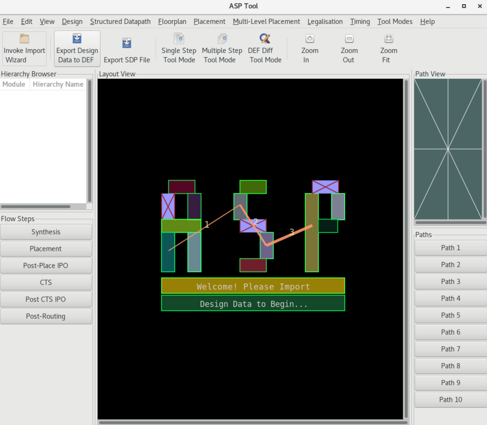

# Tool Fundamentals

The user can run UPSET via the command line as follows:

```bash
%> <path_to_upset>/./pathviz ?-help? ?-no_gui? ?-f <TCL_script>?
```

where:

- `<path_to_upset>` is the path to the UPSET directory
- `?-help?` is an optional argument that displays a help message, describing UPSET command line arguments
- `?-no_gui?` is an optional argument that disables the GUI. To show the GUI or hide it, TCL commands `show_gui` and `hide_gui` can be used
- `?-f <TCL_script>?` is an optional argument that specifies the TCL script to be executed

## Default UPSET Startup Script

A default UPSET Startup Script is executed if  the relevant file exists. The default ASP TCL script should be named as config.asp and exist in the same directory as the UPSET executable.

## Error Reporting and Bugs
The output of the tool should be saved in a log file for later reference and ease of searching problems and bugs in the log. **Log generation is not automatic**, and should be performed by the user, by invoking the tool using the `tee` Unix command, as follows:

```bash
%> <path_to_upset>/./pathviz | tee <log_file>
```

where:

- `<path_to_upset>` is the path to the UPSET directory
- `<log_file>` is the name of the log file to be created

In casem only the output of the specific TCL commands is desired, then the log generation is performed by surroing the TCL commands, for which the output must be saved in the log file, with the following TCL command:

```tcl
%> log_output_to_file <log_file>
# <TCL commands>
%> close_log_output_file
```

where:

- `<log_file>` is the name of the log file to be created

## UPSET Graphical User Interface (GUI)

The UPSET User Interface is shown below. It consists of:

- a Layout Area, where the design's Floorplan and Standard-Cell Placement is shown
- a Hierarchy Browser, illustrating the design's hierarchical stricture, and
- a set of Flow Step buttons, Toolbar Icons and Menus.

{ align=right , width=400}

The Path View and the Path Buttons are not used for the UPSET flow but represent alternative tool functionality. Flow steps buttons correspond the different design contexts, which may be simultaneously loaded. By clicking a Flow Step button, a different design context is loaded, and the Layout Area is updated to show the design context. This feature is not directly relevant to the UPSET flow. Flow steps may be used to load multiple, potentially different designs in memory. The sole restriction is that the design libraries (LEF) are common. The Hierarchy Browser, except for illustrating the design's hierarchy, also allows Verilog module operation to be performed, e.g. obtaining information on a given module through the GUI. All GUI operations are also available through the TCL scripting interface. The File Menu corresponds to importing and exporting data (LEF, LIB, DEF, Verilog, SDF, STA Report), the Edit Menu corresponds to GUI setup, searching for nets or components and various other basic operations, the Tool Modes Menu is used for alternative tool functionality, the Design Menu is used to output various design data, e.g. components, gate pins, modules, etc., whereas the Placement Flow Menu contains all the steps of the ASP flow and is thus the most relevant.