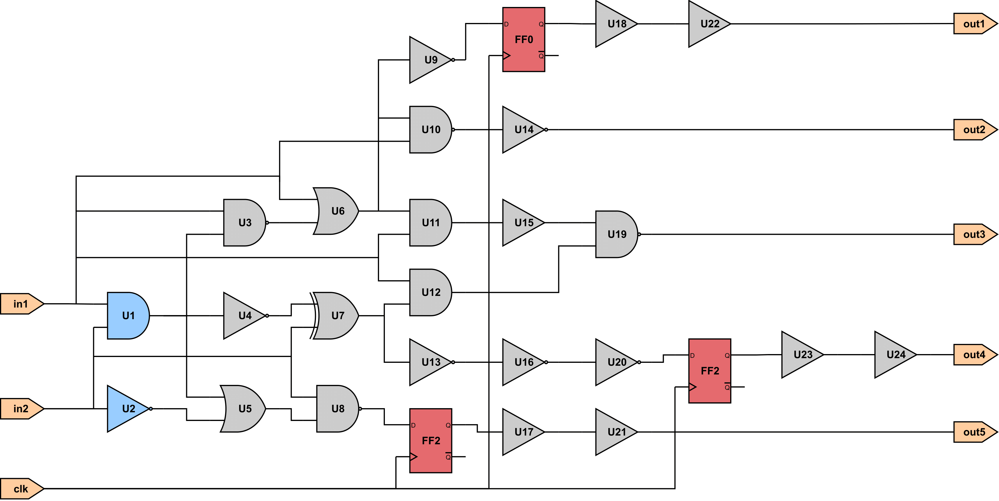
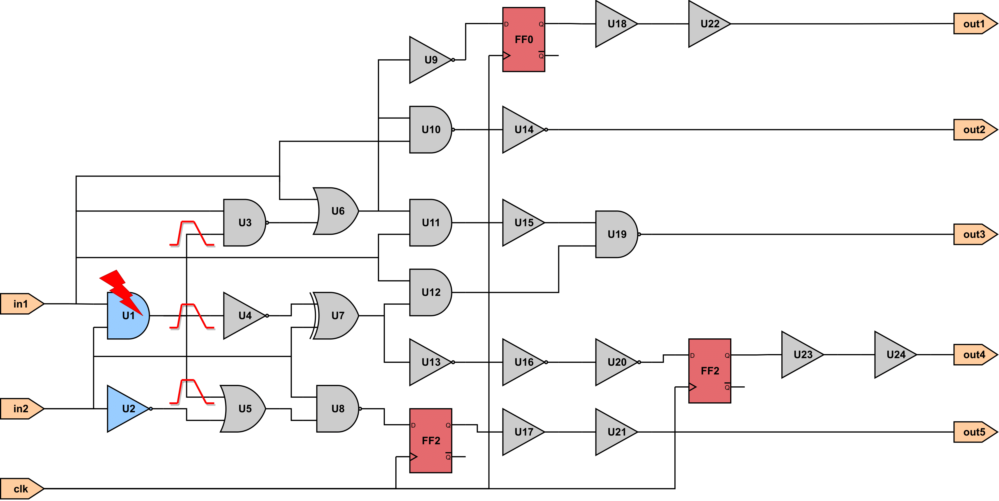
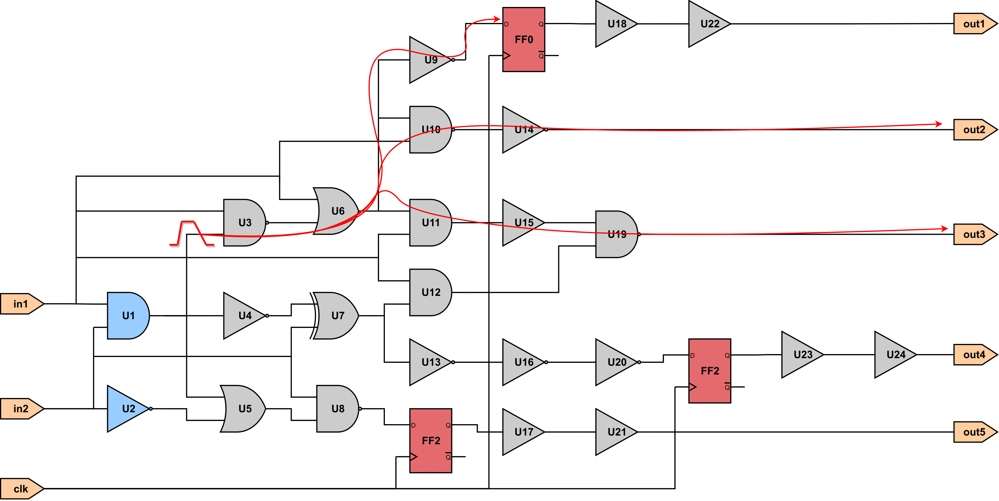
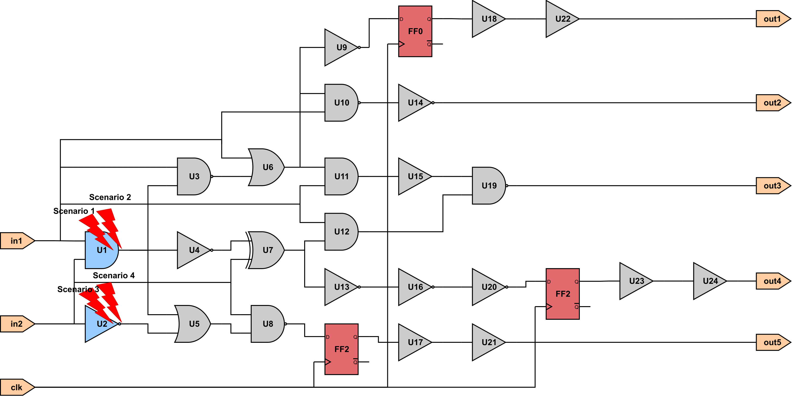
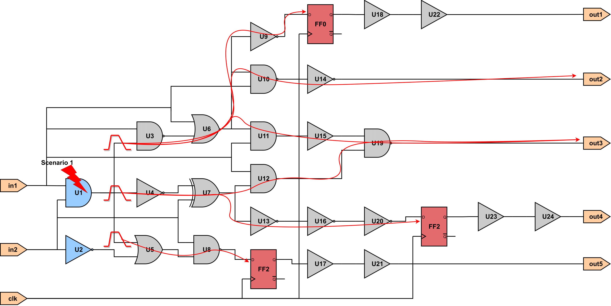
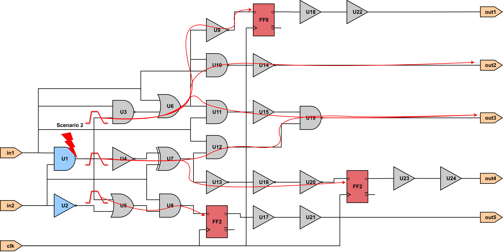
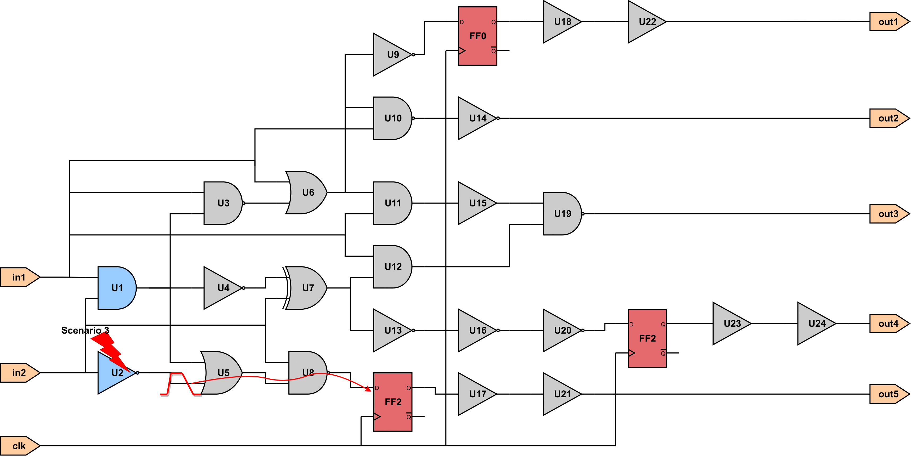
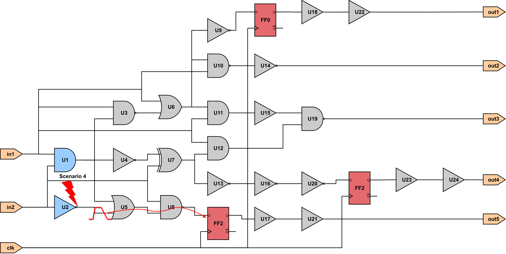
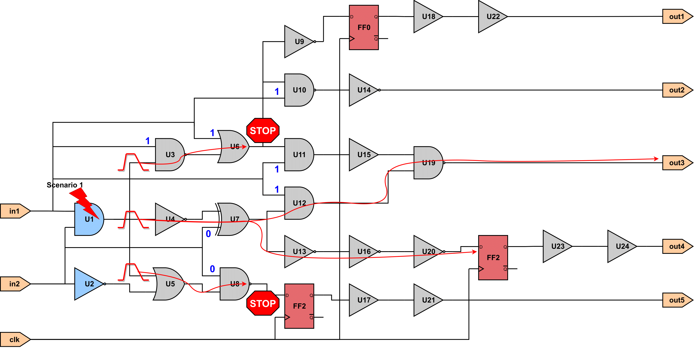

# Tutorial flows

This appendix presents some basic flows performing SET generation and propagation inside the ASP tool. For the following tutorials the design, whose schematic is presented in the following [figure](#fig:tutorials_design), is used.

<figure markdown id="fig:tutorials_design">
  
  <figcaption>Schematic of the design used for the following tutorials</figcaption>
</figure>

## ECO SET Analysis

In this tutorial, we present a flow to generate a SET glitch at the output of a gate and propagate it to the forward logic cone.

### SET Generation (ECO)

Below, is shown a TCL script generating a SET glitch at the output gatepin of the U1 gate, as shown in the following [figure](#fig:SET_Generation_ECO).

<figure markdown id="fig:SET_Generation_ECO">
  
  <figcaption>Generating a SET at the output of the U1 gate</figcaption>
</figure>

```tcl title="Tutorial Script: SET Generation at U1 output gatepin"
load_lef ihp_013.lef
load_lib ihp_013_typ.lib
load_verilog tutorial_design.v

# Set timing model to CCS
set_timing_model ccs

# Perform Static Timing Analysis (STA)
report_timing

# Generate a SET glitch at the output gatepin of U1
generate_SET_glitch -scenario U1/Q U3/B 0.5n 54p 391p 342f -corner 0
```

### SET Propagation (ECO)

After the generation of the SET at the output of the gate, the generated SETs can be propagated to the forward logic cone, as shonw in the following [figure](#fig:SET_Propagation_ECO).

<figure markdown id="fig:SET_Propagation_ECO">
  
  <figcaption>Propagation of the SET defined at the input of U3 gate</figcaption>
</figure>

```tcl title="Tutorial Script: SET Propagation from U3 input gatepin B"
load_lef ihp_013.lef
load_lib ihp_013_typ.lib
load_verilog tutorial_design.v

# Set timing model to CCS
set_timing_model ccs

# Create clock
create_clock clk -period 1 -waveform {0 0.5}
set_input_delay 0 -clock clk [all_inputs]
set_output_delay 1 -clock clk [all_outputs]

# Perform Static Timing Analysis (STA)
report_timing

# Propagate a SET glitch from the input gatepin B of U3
propagate_SET_glitch -gatepin U3/B -rise {0.538644 0.030392} -fall
{1.557695 0.542653}
```

## SET Analysis for Loaded SET Scenarios

In this tutorial, we present a flow of SET generation and propagation for the loaded SET Scenarios.

### SET Generation for Loaded SET Scenarios

Below, we present a flow to generate SET glitches by creating first some SET scenarios. In contrast, to the Tutorial [SET Generation (ECO)](#set-generation-eco) creating SET scenarios allows the user to generate multiple SETs at once, as shown in the following [figure](#set-generation-for-loaded-set-scenarios). It is important to note that each SET scenario is independent of the rest and the SET generation for one scenario does not affect the SET generation for another one.

<figure markdown id="fig:tutorial_SET_scenario_generation">
  
  <figcaption>Multiple SET Scenarios at the outputs of U1 and U2 gates</figcaption>
</figure>

One way to create SET scenarios is by running the TCL command `create_SET_scenario` as shown in the the following script.

```tcl title="Tutorial Script: SET generation for the created SET scenarios"
load_lef ihp_013.lef
load_lib ihp_013_typ.lib
load_verilog tutorial_design.v

# Set timing model to CCS
set_timing_model ccs

# Create SET scenarios
create_SET_scenario U1/Q FF0/D 0.5n 61p 433p 355f
create_SET_scenario U1/Q FF0/D 0.5n 48p 487p 381f
create_SET_scenario U2/Q FF2/D 0.5n 52p 618p 347f
create_SET_scenario U2/Q FF2/D 0.5n 46p 545p 285f

# List created SET scenarios
list_SET_scenarios

# Generate SETs for all created scenarios
generate_SET_scenario_glitch -all
```

An alternative way to create SET scenarios is by creating a .scenario file where each line specifies a SET scenario. The scenario file for the SET scenarios created previously is presented below.

```text
U1/Q FF0/D 0.5n 61p 433p 355f
U1/Q FF0/D 0.5n 48p 487p 381f
U2/Q FF2/D 0.5n 52p 618p 347f
U2/Q FF2/D 0.5n 46p 545p 285f
```

Then, this file can be loaded into ASP by the TCL command load_SET_scenarios, as shown in the following TCL script.

```tcl title="Tutorial Script: SET generation for the loaded SET scenarios"
load_lef ihp_013.lef
load_lib ihp_013_typ.lib
load_verilog tutorial_design.v

# Set timing model to CCS
set_timing_model ccs

# Load SET scenarios
load_SET_scenarios tutorial_scenario_file.scenario

List created SET scenarios
list_SET_scenarios

Generate SETs for all created scenarios
generate_SET_scenario_glitch -all
```

### SET Propagation for Loaded SET Scenarios

Similarly to SET generation for the created SET scenarios, the generated SET pulses of each SET scenario can be propagated to the forward logic cone, by running the TCL command propagate_SET_scenario_glitch.

<table id="tab:set_scenario_propagation_tutorial">
<caption><strong>SET propagation for the specified SET scenarios</strong></caption>
<thead>
<tr>
<td style="text-align: center;"><br>(a) SET Propagation for scenario 1</td>
<td style="text-align: center;"><br>(b) SET Propagation for scenario 2</td>
</tr>
<tr>
<td style="text-align: center;"><br>(c) SET Propagation for scenario 3</td>
<td style="text-align: center;"><br>(d) SET Propagation for scenario 4</td>
</tr>
</thead>
</table>

The following TCL script propagates the SETs generated for each SET scenario specified in the scenario file loaded in the previous step.

```tcl title="Tutorial Script: Propagation of the generated SET pulse for the loaded SET scenarios"
load_lef ihp_013.lef
load_lib ihp_013_typ.lib
load_verilog tutorial_design.v

# Set timing model to CCS
set_timing_model ccs

# Create clock
create_clock clk -period 1 -waveform {0 0.5}
set_input_delay 0 -clock clk [all_inputs]
set_output_delay 1 -clock clk [all_outputs]

# Load SET scenarios
load_SET_scenarios tutorial_scenario_file.scenario

# Perform Static Timing Analysis (STA)
report_timing

# Generate SETs for all created scenarios
generate_SET_scenario_glitch -all

# Propagate the generated SETs for all created scenarios
propagate_SET_scenario_glitch -all
```

#### Vector-based SET Propagation setting Case Analysis

In Vector-based SET Analysis, the user must set values to the gates’ side inputs to support logical masking. This is supported only in the case of SET scenarios stored in memory.

Setting side input values is performed by creating a case analysis for a specified SET scenario. This is done by running the TCL command `create_SET_scenario_case_analysis`. The following script annotates values to side inputs of gates for the 1st SET scenario.

```tcl title="Tutorial Script: Propagation of the generated SET pulse for scenario 1 setting case analysis first"

load_lef ihp_013.lef
load_lib ihp_013_typ.lib
load_verilog tutorial_design.v

# Set timing model to CCS
set_timing_model ccs

# Create clock
create_clock clk -period 1 -waveform {0 0.5}
set_input_delay 0 -clock clk [all_inputs]
set_output_delay 1 -clock clk [all_outputs]

# Create SET scenarios
load_SET_scenarios tutorial_scenario_file.scenario

# List created SET scenarios
list_SET_scenarios

# Create SET case analysis for scenario 1
create_SET_scenario_case_analysis -scenario 1 1 {U3/AN U6/A U10/B U11/B
U12/A}
create_SET_scenario_case_analysis -scenario 1 0 {U7/B U8/AN}

# Perform Static Timing Analysis (STA)
report_timing

# Generate SETs for all created scenarios
generate_SET_scenario_glitch -scenario 1

# Propagate the generated SETs for all created scenarios
propagate_SET_scenario_glitch -scenario 1
```

<figure markdown id="fig:vector-based_set_propagation">
  
  <figcaption>SET Propagation for scenario 1 with case analysis</figcaption>
</figure>

The above [figure](#fig:vector-based_set_propagation) shows the SET propagation for the above TCL script. Setting the side input of U6 to 1 results in the SET propagation stopping due to logical masking, since the input value 1 is the controlling value for the OR gate. Similarly, setting the input of U8 to 0 results in the SET propagation stopping due to logical masking.

#### Probabilistic SET Propagation

In the case of Probabilistic SET Analysis, the user must perform static probabilities annotation to support logical masking. The static probabilities annotation is performed by the TCL command `list_static_probabilities`. The following TCL script performs a probabilistic SET analysis, by annotating first the static probabilities by setting a 0.5 probability to all starting points, i.e. Primary Inputs (PIs) and FFs outputs, and computing them for the rest gatepins of the circuit using the 0-Algorithm. Then, SET generation and propagation are performed, setting the SET propagation mode to "Vanilla" STA-mode.

```tcl title="Tutorial Script: Probabilistic SET Propagation of the generated SET pulses for all scenarios"
load_lef ihp_013.lef
load_lib ihp_013_typ.lib
load_verilog tutorial_design.v
# Set timing model to CCS
set_timing_model ccs

# Create clock
create_clock clk -period 1 -waveform {0 0.5}
set_input_delay 0 -clock clk [all_inputs]
set_output_delay 1 -clock clk [all_outputs]

# Create SET scenarios
load_SET_scenarios tutorial_scenario_file.scenario

# List created SET scenarios
list_SET_scenarios

# Perform Static Timing Analysis (STA)
report_timing

# Generate SETs for all created scenarios
generate_SET_scenario_glitch -all

# Set inputs static probabilities
set_static_probability -value -0.5 -startpoints

# List static probabilities
list_static_probabilities -significant_digits 5

# Set the SET analysis mode to Probabilistic
set_SET_analysis_mode 1

# Set the SET glitch propagation mode to "Vanila" STA mode
set_SET_glitch_propagation_mode 0

# Propagate the generated SETs for all created scenarios
propagate_SET_scenario_glitch -all
```
